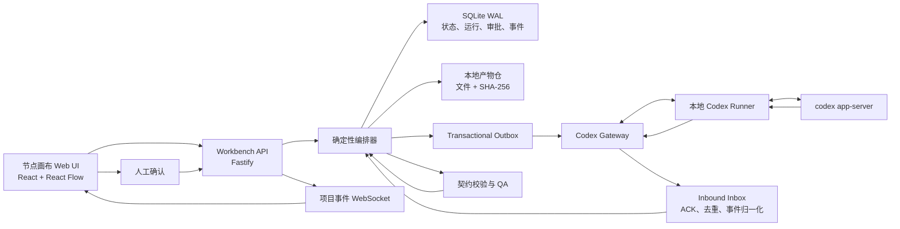

# 《柠萌旅行记》可视化节点画布 Agent 方案

版本：V1.3
日期：2026-08-11

## 1. 结论

建议采用“三层职责架构”：

- 画布层：React + TypeScript + React Flow（`@xyflow/react`），负责进度可视化、受约束操作、素材与产物查看、人工确认；首版不负责自由编辑正式流程。
- 执行层：独立的确定性编排器，负责状态、Gate、依赖、重试、检查点、审批、事件和产物验收。
- AI 执行层：参考 `remote-codex-control` 的真实链路，由本地 Runner 通过 `stdio + JSONL` 驱动 `codex app-server`，再以出站 WebSocket 连接 Gateway；Codex 只能生产节点结果，不能自行推进流程状态。

画布是“生产控制台”，不是唯一事实源。首版本机单用户部署中，唯一运行事实源是 SQLite 中的工作流快照、节点运行、审批与事件；工程目录保存版本化 Workflow Manifest、文件产物与哈希清单，`project-state.generated.json` 只作为可导出的状态投影。

本方案对用户提供的节点画布截图只继承界面语言：深色点阵无限画布、富内容节点、端口连线、节点内配置和直接操作。截图中的“素材组 → 提示词 → 图片生成”不是本项目的业务流程，也不会替代下文定义的23个正式生产阶段。

### 1.1 产品定位与实施决策

- 产品形态是浏览器访问的本机 Web 工作台，不是桌面应用。
- 首版是“固定生产流程的执行与监控台”，不是通用低代码节点编辑器。
- 数据层保留23个正式阶段；总览层默认折叠为6个生产 Frame，阶段内部按需展开。
- 首条真实执行分为Phase 2A“方向与脚本01–07”和Phase 2B“分镜08–17”；2B必须消费06批准的脚本并经过R0与执行配置，不允许为缩短演示而绕过Gate。
- 模板编辑、多用户协同、公网 SaaS 和任意模型编排不进入 MVP。

### 1.2 成功标准

工作台的成功不以“能画出节点”衡量，而以以下结果衡量：

1. 用户无需打开工程文件夹，即可判断当前进度、推荐下一步、全部合法下一步与阻塞原因。
2. AI 即使声称任务完成，只要产物或验证证据缺失，节点仍不能 PASS。
3. 上游产物变化后，所有依赖旧哈希的下游结果自动进入 STALE。
4. 浏览器刷新、服务重启、Runner 断线或重复点击不会造成状态丢失、重复推进或误判完成。

## 2. 问题诊断

任务 `019fa165-d2b6-7c31-a640-c16c02c4c6ac` 暴露的不是单点文案遗漏，而是流程控制问题：

1. 新旧流程文档同时定义生产顺序，事实源冲突。
2. R0 动作资产编号和正式镜号混入同一进度叙述。
3. 总账同时存在“动作未完成”和 `gate=PASS`，状态可被错误手写放行。
4. 分镜执行配置、分镜草图不存在时，仍可进入接近真实分镜的生成。
5. 当前 Index 缺少方向确认、草图、静态确认、资产晋升等完整阶段证据。
6. 聊天中的“继续”被当成执行依据，而不是由持久化状态计算唯一下一步。

因此，防漏的重点不是把 Prompt 写得更长，而是让任何节点都无法在依赖、输入、产物或 Gate 不完整时进入执行。

## 3. 总体架构



### 核心边界

- 编排器是唯一允许改变 `current_node`、`gate` 和 `allowed_next_nodes` 的组件。
- Codex Worker 只返回结构化结果，不具有推进流程的权限。
- Skill 只负责生产或检查，不直接修改工程总状态。
- 每个节点的 PASS 必须由 Validator 根据产物契约计算，不接受 AI 自报 PASS。
- UI 状态从后端事件和状态投影得到，不能在前端本地伪造完成状态。
- Codex 的 `turn.completed`、产物已收集和业务验证 PASS 是三个独立事实；只有最后一个事实可以解锁下游。
- 浏览器只连接 Workbench API；不直接连接或暴露 `codex app-server`。
- 运行命令通过事务 Outbox 发出，避免数据库已写入但 Runner 未收到命令，或命令已执行但运行记录不存在。
- Runner必须持久化幂等Inbox并返回ACK；Gateway接收的事件也必须经Inbox去重，整体语义是“至少一次投递 + 幂等消费”，不宣称跨进程恰好一次。

## 4. 工程与运行数据模型

### 4.1 ScriptProject

```json
{
  "project_id": "EP01-V2.9.21",
  "series": "柠萌旅行记",
  "episode": "EP01",
  "workflow_version": "travel-script-v1",
  "workflow_hash": "sha256:...",
  "status": "IN_PROGRESS",
  "current_node_ids": ["script-review"],
  "allowed_next_node_ids": [],
  "created_at": "...",
  "updated_at": "..."
}
```

### 4.2 NodeDefinition（不可变定义）

每个工作流版本中的节点定义必须声明：

- `definition_id`、`node_type`、`stage`、`label`。
- `ui_schema`：不同缩放级别展示字段和允许操作。
- `ports`：带类型、方向、基数和兼容规则的输入输出端口。
- `operation_id`：逻辑操作ID，只能通过Skill Route Registry解析，不能直接当作可调用Skill。
- `dependencies`：必须满足的上游节点、边类型和Gate条件。
- `required_inputs`：素材角色、最小数量、版本、哈希和允许来源。
- `expected_outputs`：文件、JSON Schema、镜号覆盖范围和最小内容要求。
- `validators`：结构、覆盖率、引用、视觉、连续性等校验器。
- `approval_policy`：无需确认、单节点确认、整阶段确认。
- `retry_policy`：最大次数、无进展阈值、超时与熔断。
- `edit_policy`：执行模式和后续模板模式分别允许哪些修改。

NodeDefinition不保存运行状态。发布后的WorkflowVersion及其NodeDefinition不可原地修改。

### 4.3 NodeInstance（工程节点实例）

同一个NodeDefinition在每个工程中实例化为独立节点，保存：

- `node_instance_id`、`project_id`、`definition_id`、`workflow_version_id`。
- `status`：`LOCKED/READY/ACTIVE/WAITING_BUSINESS_APPROVAL/PASS/FAIL/BLOCKED/STALE`。
- `active_run_id`、`accepted_run_id`、`revision`。
- 当前已满足输入的Artifact ID与哈希、阻断码、STALE原因。

`revision`用于乐观锁；浏览器命令必须携带预期revision，防止多个标签页同时推进同一节点。

### 4.4 ArtifactRef

素材和产物不只保存路径，还保存：

```json
{
  "artifact_id": "script-final-v2.9.21",
  "role": "FORMAL_SCRIPT",
  "uri": "project://scripts/final.md",
  "sha256": "...",
  "version": "2.9.21",
  "source_node_id": "script-confirm",
  "approval_id": "...",
  "scope": ["S01", "S19"],
  "status": "APPROVED",
  "trust": "GENERATED_AND_VALIDATED"
}
```

Artifact状态固定为`IMPORTED/CANDIDATE/VALID/APPROVED/REJECTED/STALE`。`REUSE`不是Artifact状态，而是当前节点对一个已验证Artifact的复用关系；导入历史产物必须标记来源与trust等级，不能伪装为本工作流生成。

### 4.5 NodeRun（单次执行）

同一节点可运行多次，但只有一个被提升为当前有效结果：

- `run_id`、`attempt`、`generation`、`input_snapshot_hash`、`idempotency_key`。
- `resolved_skill`、`codex_task_id`、`worker_version`、`runner_id`。
- `started_at`、`heartbeat_at`、`finished_at`、`elapsed_ms`。
- `status`：`CREATED/DISPATCH_PENDING/DISPATCHED/RUNNING/WAITING_TOOL_APPROVAL/COLLECTING_ARTIFACTS/VALIDATING/SUCCEEDED/FAILED/TIMED_OUT/CANCELLED/LOST`。
- `outputs`、`validation_report`、`receipt`、`error_code`。

业务人工确认属于NodeInstance状态与Approval实体，不属于NodeRun状态。只有当前generation的运行可以提交候选产物；旧运行迟到的事件和文件只能归档，不能覆盖新结果。

### 4.6 状态转换权威规则

| 对象 | 起始状态 | 目标状态 | 必要条件 |
|---|---|---|---|
| NodeInstance | LOCKED/BLOCKED | READY | 全部依赖与输入Gate满足 |
| NodeInstance | READY | ACTIVE | NodeRun事务创建成功 |
| NodeInstance | ACTIVE | WAITING_BUSINESS_APPROVAL | 当前generation运行验证成功且需要人工确认 |
| NodeInstance | ACTIVE | PASS | 当前generation运行验证成功且不需要人工确认 |
| NodeInstance | ACTIVE | FAIL | 当前generation运行失败或验证失败 |
| NodeInstance | ACTIVE | BLOCKED | 当前generation运行LOST或执行环境不可用 |
| NodeInstance | ACTIVE | READY | 当前generation已确认CANCELLED且依赖仍有效 |
| NodeInstance | WAITING_BUSINESS_APPROVAL | PASS | 绑定当前Artifact哈希的批准有效 |
| NodeInstance | WAITING_BUSINESS_APPROVAL | FAIL | 用户拒绝或要求修改，并生成REWORK目标 |
| NodeInstance | PASS | STALE | 任一实际消费输入哈希、契约或验证规则变化 |
| NodeInstance | FAIL/STALE/BLOCKED | READY | 问题已修复且重新计算Gate通过 |
| NodeRun | CREATED | DISPATCH_PENDING | outbox与运行记录同事务提交 |
| NodeRun | DISPATCH_PENDING | DISPATCHED | 收到Runner持久化Inbox ACK |
| NodeRun | DISPATCHED | RUNNING | 收到匹配generation的Codex turn started |
| NodeRun | RUNNING | WAITING_TOOL_APPROVAL | 收到匹配thread/turn/action的工具审批请求 |
| NodeRun | WAITING_TOOL_APPROVAL | RUNNING | 当前审批被允许且Codex继续执行 |
| NodeRun | RUNNING | COLLECTING_ARTIFACTS | Codex turn正常完成 |
| NodeRun | COLLECTING_ARTIFACTS | VALIDATING | 产物原子提交且Collector验证文件集合完成 |
| NodeRun | VALIDATING | SUCCEEDED/FAILED | 全部Validator产生确定结论 |
| NodeRun | 非终态 | TIMED_OUT/CANCELLED/LOST | 分别由deadline、确认中断、对账失败触发 |

除表中转换外一律拒绝并写审计事件。NodeRun的`SUCCEEDED`只说明机器验证完成，NodeInstance仍可能等待业务审批。

Artifact只允许`IMPORTED/CANDIDATE → VALID/REJECTED → APPROVED`，以及`VALID/APPROVED → STALE`；原文件变化时创建新Artifact版本，不原地替换哈希。Approval状态为`PENDING/APPROVED/REJECTED/EXPIRED/REVOKED`，绑定的action或Artifact哈希变化后自动进入EXPIRED。

### 4.7 运行真相与视图状态分离

必须将业务状态与画布视图状态分开保存：

- 业务状态：项目、工作流版本、节点运行、产物、验证、审批、事件，由服务器维护。
- 视图状态：视口、节点视觉坐标、Frame展开状态、面板宽度、筛选条件，可按用户独立保存。
- 自动布局和用户拖动只修改视图状态，不得改写流程依赖。
- React Flow/Zustand 中的节点对象只是服务器状态投影，刷新时可完全重建。

### 4.8 首版持久化实体

| 实体 | 职责 |
|---|---|
| `projects` | 工程根目录、状态和绑定的工作流版本 |
| `workflow_versions` | 不可变流程定义、Schema版本和定义哈希 |
| `node_instances` / `edge_instances` | 当前工程实例化后的正式拓扑、状态与revision |
| `node_runs` | 每次尝试、状态、输入快照和Codex绑定 |
| `artifacts` / `run_artifacts` | 产物路径、类型、SHA-256与生产来源 |
| `validations` | 验证器版本、结论、证据和缺口 |
| `approvals` | 工具审批与业务审批，绑定动作或产物哈希 |
| `events` | 项目级递增序号、幂等来源ID和事件载荷 |
| `outbox` | 已提交但尚未可靠发送给Gateway的命令 |
| `inbox` | Runner ACK与入站事件去重、来源序号映射 |
| `view_state` | 视口、展开状态和用户布局偏好 |

## 5. 完整生产节点图

所有生产节点以 `designing-travel-comedy-series` 作为候选入口路由；画布只保存稳定的`operation_id`。表中的operation当前是逻辑意图，不代表对应Skill已被验证存在。只有`skill-route-registry.json`完成解析与契约校验后，编排器才能冻结并调用实际Skill路径、版本和哈希。

23个阶段是数据层与审计层的正式流程，不代表总览必须同时显示23张完整卡片。默认总览按下表折叠为6个 Frame：

| Frame | 包含阶段 | 总览摘要 |
|---|---|---|
| F1 方向与脚本 | 00–06 | 当前版本、方向确认、脚本批准状态 |
| F2 清单与R0 | 07–11 | 素材缺口、ACTION完成率、R0 Gate |
| F3 分镜准备 | 12–14 | 执行配置、草图覆盖率、草图QA |
| F4 分镜定稿 | 15–17 | Sxx完成率、静态QA、整集人工确认 |
| F5 视频与交付 | 18–19 | Seedance包、逐镜使用指引 |
| F6 归档与验收 | 20–22 | 资产晋升、项目地图、最终收据 |

Frame 摘要由内部正式节点状态计算。Frame 自身不是可绕过子阶段的额外业务节点，也不能直接手工标记 PASS。

| # | 节点 | Skill 操作意图 | 主要输入素材 | 必须产物 / PASS 条件 |
|---|---|---|---|---|
| 00 | 创建脚本工程 | `create_episode_project` | 系列设定、城市/地点、集号、模板版本 | 工程 Manifest、目录、工作流快照 |
| 01 | 方向提案 | `plan_episode_directions` | 系列定位、角色设定、历史 EP、地点资料 | 至少 N 个方向、差异与风险 |
| 02 | 方向评估 | `evaluate_directions` | 方向提案、系列规则、受众规则 | 逐方向评分、缺口、推荐结论 |
| 03 | 方向人工确认 | 无 AI 自动放行 | 方向评估结果 | 用户签名的单一方向确认记录 |
| 04 | 脚本设计 | `generate_story_script` | 已确认方向、角色设定、节奏模板、地点素材 | 完整脚本、场次/镜头覆盖清单 |
| 05 | 脚本评估与修订 | `review_and_revise_script` | 完整脚本、规则库、上一版差异 | 全稿评估、修订稿、继承/等价证明 |
| 06 | 脚本人工确认 | 无 AI 自动放行 | 修订稿、差异报告 | 正式脚本锁定、版本哈希、批准记录 |
| 07 | 素材 Checklist | `build_asset_checklist` | 正式脚本、角色/场景/道具资产库 | 逐镜素材矩阵、缺失项、复用项 |
| 08 | GPT 文字分镜 | `generate_text_storyboard` | 正式脚本、Checklist、镜头规则 | S01–Sn 全覆盖文字分镜，无跳号 |
| 09 | R0 资产规划 | `plan_r0_assets` | 文字分镜、缺失素材、风险动作 | ACTION/SUPPORT 任务图、依赖顺序 |
| 10 | R0 资产制作 | `generate_or_select_r0_asset` | 每个 ACTION 的原始参考、动作关系锁 | 每项 PASS 或有证据的 REUSE；禁止命名为 Sxx |
| 11 | R0 Gate | `audit_r0_coverage` | R0 总账、全部 ACTION 收据 | 未完成数为 0；状态之间无矛盾 |
| 12 | 分镜执行配置 | `build_storyboard_execution_config` | 正式脚本、Checklist、R0、参考目录 | 逐镜 reference pack 与允许参考规则 |
| 13 | 分镜草图 | `generate_storyboard_drafts` | 文字分镜、执行配置、R0 | 路线图 + S01–Sn 草图 + 高风险链草图 |
| 14 | 草图 QA | `review_storyboard_drafts` | 草图、正式脚本、连续性规则 | 镜号全覆盖；机位/轴线/动作/空间关系 PASS |
| 15 | 真实分镜 | `generate_final_storyboard_frame` | 正式脚本、Checklist、对应草图、同场上一张 PASS 镜 | 一次一镜；逐镜产物、参考披露与 QA |
| 16 | 资产与静态 QA | `review_static_episode` | 全部真实分镜、资产清单、声音/连续性规则 | 整集覆盖、连续性、资产、归档 PASS |
| 17 | 静态分镜人工确认 | 无 AI 自动放行 | 整集静态总览、QA 报告 | 整集确认 Manifest；单镜确认不可替代 |
| 18 | Seedance 2.0 包 | `generate_seedance_package` | 已确认静态链、正式脚本、镜头参数 | S01–Sn 视频提示词包与参数清单 |
| 19 | 完整使用指引 | `generate_usage_guide` | 正式脚本、全部资产、Seedance 包 | 逐镜素材与提示词使用说明 |
| 20 | 通用资产晋升 | `promote_reusable_assets` | 本集 PASS 资产、复用判断规则 | 晋升记录、版本与适用边界 |
| 21 | 项目地图更新 | `update_project_map` | 全部产物、资产晋升记录 | 系列/单集/输出地图一致 |
| 22 | 最终验收 | `final_episode_acceptance` | 所有 Gate 和收据 | 零缺失、零悬空引用、最终验收收据 |

说明：R0 资产制作和真实分镜应展开为“父节点 + 动态子节点”。例如 R0 父节点下生成 `ACTION-01` 至 `ACTION-07`；真实分镜父节点下生成 `S01` 至 `S19`。父节点只有在全部必需子节点 PASS/REUSE 后才可 PASS。

### 5.1 可执行图不是阶段序号

正式`workflow.travel-v1.json`必须显式保存节点、端口和边，阶段编号只用于阅读与排序，不能充当执行依赖。边至少分为：

- `DATA`：传递Artifact及其哈希；
- `CONTROL`：上游满足后允许调度；
- `APPROVAL`：指定Approval有效后放行；
- `REWORK`：失败或拒绝后回到指定节点；
- `EXPANSION`：父节点创建动态子节点。

主干与人工返工关系：

```mermaid
flowchart LR
  N00["00 创建工程"] --> N01["01 方向提案"] --> N02["02 方向评估"] --> N03{"03 方向确认"}
  N03 -->|"批准"| N04["04 脚本设计"]
  N03 -->|"要求修改"| N01
  N04 --> N05["05 脚本评估与修订"] --> N06{"06 脚本确认"}
  N06 -->|"批准"| N07["07 Checklist"]
  N06 -->|"要求修改"| N04
  N07 --> N08["08 文字分镜"] --> N09["09 R0规划"] --> N10["10 R0动态任务"] --> N11{"11 R0 Gate"}
  N11 -->|"PASS"| N12["12 分镜执行配置"] --> N13["13 草图动态任务"] --> N14{"14 草图QA"}
  N11 -->|"FAIL"| N10
  N14 -->|"PASS"| N15["15 真实分镜动态任务"] --> N16{"16 静态QA"} --> N17{"17 静态确认"}
  N14 -->|"FAIL"| N13
  N16 -->|"FAIL"| N15
  N17 -->|"要求修改"| N15
  N17 -->|"批准"| N18["18 Seedance包"] --> N19["19 使用指引"] --> N20["20 资产晋升"] --> N21["21 项目地图"] --> N22["22 最终验收"]
```



### 5.2 动态子节点与父节点聚合

- 09 PASS后根据R0计划冻结`required_action_ids`，10为每个ACTION/SUPPORT创建子NodeInstance。
- 12 PASS后根据正式脚本冻结`required_shot_ids`，13和15分别创建Sxx草图与正式分镜子节点。
- 可并行节点由调度器同时置为READY；同场连续镜若依赖上一张PASS镜，则保存显式DATA边并按拓扑顺序执行。
- 父节点状态按必需子节点集合计算：全部`PASS`或存在合规reuse关系才PASS；任一必需子节点FAIL则父节点FAIL；输入集合变化则重新展开版本并使旧子节点STALE。
- 动态展开必须幂等：`project_id + parent_node_id + child_business_id + expansion_version`唯一。

### 5.3 Skill Route Registry

每个operation必须在`skill-route-registry.json`中登记：

```json
{
  "operation_id": "generate_storyboard_drafts",
  "entry_skill": "designing-travel-comedy-series",
  "resolved_skill": "<verified-path>",
  "skill_version": "<verified-version>",
  "skill_hash": "sha256:...",
  "input_schema": "schemas/storyboard-draft-input.schema.json",
  "output_schema": "schemas/node-result.schema.json",
  "validators": ["file-exists", "shot-coverage", "spatial-continuity"],
  "retry_classification": ["TRANSIENT", "INPUT_INVALID", "BUSINESS_FAIL", "PERMISSION_DENIED"]
}
```

Registry未验证、Skill哈希变化或输入输出Schema不兼容时，节点保持BLOCKED并显示`SKILL_ROUTE_UNRESOLVED`，不能临时让Codex猜测执行方式。

## 6. 防漏与防跳阶段机制

### 6.1 覆盖率不是文本判断，而是集合运算

- 正式脚本产出 `required_shot_ids = {S01...S19}`。
- 文字分镜、草图、真实分镜分别产出自己的 `produced_shot_ids`。
- Gate 计算 `missing = required - produced`、`extra = produced - required`、`duplicates`。
- 只要三者任一非空，节点不得 PASS。

### 6.2 状态不可由多份文档各自维护

- SQLite 中由编排器提交的项目、节点运行、验证、审批和事件记录是唯一运行状态源。
- `project-state.generated.json`、README、总账、Index、画布均为只读投影，可随时从数据库与产物清单重建。
- 派生文档不能写 `gate=PASS`；只能由编排器在校验后原子写入。

### 6.3 硬 Gate

- 方向无人工确认：禁止脚本设计。
- 正式脚本无批准哈希：禁止 Checklist。
- R0 未全量 PASS/REUSE：禁止分镜执行配置。
- 分镜执行配置缺失：禁止草图。
- 草图 Manifest 未 PASS：禁止真实分镜。
- 整集静态确认缺失：禁止 Seedance 正式包。
- 任何输入文件哈希变化：下游节点标记 `STALE`，必须重新验证或重跑。

### 6.4 节点执行前后双检查

执行前：依赖、素材数量、类型、版本、哈希、用户批准、允许写入范围。

执行后：JSON Schema、镜号覆盖、引用存在、文件哈希、规则 QA、人工确认要求。

### 6.5 有界运行

- 单节点超时后标记 `TIMED_OUT`，不无限等待。
- 默认最多 3 次；连续两次输出哈希或缺口无实质改善时熔断。
- 失败后创建结构化Problem并保持节点FAIL，不能静默跳到后续节点；诊断建议显示在节点检查器，不要求MVP动态创建诊断节点。
- 每 10–30 秒写 heartbeat；UI 区分“正在推理”“等待工具”“等待用户”“疑似失联”。

### 6.6 标准执行收据

每次 Skill 运行都必须先写入本次attempt的`staging/`目录，并最终生成符合版本化Schema的`node-result.json`，至少包含：

- Workflow、NodeDefinition、Skill 和验证规则版本；
- 输入产物ID、版本与哈希；
- 实际使用的参考素材；
- 输出文件清单、类型和业务覆盖范围；
- Codex thread/turn ID、开始时间、结束时间；
- 结构化警告、错误和执行摘要。

所有输出先写入staging；`node-result.json`最后写入，随后将临时完成标记原子rename为`complete.marker`。Collector只接收完成标记对应的文件集合，再把整个集合提交为只读`committed-outputs`。该收据可以报告建议结论，但无权决定节点PASS。缺少收据、Schema不合法、文件越界、声明产物不存在或文件仍在写入时，NodeRun进入FAILED。

### 6.7 单次运行事务

1. API校验会话、Origin、工程revision、节点状态、前置Gate与输入完整性。
2. 单个数据库事务创建NodeRun、递增generation、冻结输入快照并写入outbox。
3. dispatcher以至少一次语义发送命令；Runner先把幂等键写入持久化Inbox，再返回ACK并开始执行。
4. Gateway在收到ACK后将运行置为DISPATCHED；重复命令返回原ACK，不启动第二次Codex任务。
5. Codex Turn完成后，NodeRun进入`COLLECTING_ARTIFACTS`，不能直接PASS。
6. Collector只读取当前generation的已原子提交staging集合，校验路径并计算SHA-256。
7. Validator执行Schema、文件、覆盖率、引用、连续性与业务规则校验。
8. 编排器原子提交NodeRun的SUCCEEDED/FAILED，并计算NodeInstance的PASS、FAIL或`WAITING_BUSINESS_APPROVAL`。
9. 若有效产物哈希变化，依赖旧哈希的下游NodeInstance进入STALE。
10. Gateway入站事件以`runner_id + source_event_id`写入Inbox去重，再映射为项目级递增seq。

服务重启后从数据库恢复运行；对中断时仍为RUNNING的记录与Runner/Codex对账。无法确认真实状态时NodeRun标记LOST，NodeInstance保持BLOCKED，不得推测为PASS。旧generation迟到的事件和文件只进入历史记录。

## 7. 完整可视化节点画布交互方案

### 7.1 设计边界

用户提供的参考图用于确定“怎样操作节点”，而不是“有哪些业务节点”。最终画布采用以下组合：

```text
参考图的深色富内容节点交互
+ React Flow 的 Group / Sub Flow / typed Handle
+ 本方案的23阶段确定性 Workflow
+ Codex 实时事件
+ Validator 与人工 Gate
```

正式流程不能因为用户在画布上连了一条线就被改变。连线首先形成候选变更，再由编排器检查端口、阶段依赖、Gate 和写入权限；只有合法变更才写入 Workflow Manifest。

### 7.2 三层画布结构

#### 第一层：单集工程总画布

默认显示第5节定义的6个生产 Frame，而不是同时铺开23个富内容阶段节点。Frame显示聚合状态、覆盖率、阻断数量和当前合法下一步，不展开内部 Prompt、素材和产物。

- 按“方向与脚本、清单与R0、分镜准备、分镜定稿、视频与交付、归档与验收”划分 Frame。
- 当前阶段高亮；其他阶段保持可见，以便理解全局进度。
- 双击 Frame 进入第二层阶段子画布，查看其内部正式阶段。
- `R0资产制作`、`分镜草图`、`真实分镜`等父节点显示动态子节点数量，例如`2/7 ACTION PASS`、`0/19 Sxx PASS`。

#### 第二层：阶段子画布

使用参考图式的富内容节点组合，真实表达一个阶段如何生产：

```text
输入素材节点
→ 配置/Prompt节点
→ Skill执行节点
→ 产物节点
→ Validator节点
→ 人工确认节点（如需要）
→ 阶段收据节点
```

例如`分镜草图`子画布：

```text
正式脚本 + Checklist + R0资产 + 分镜执行配置
→ designing-travel-comedy-series / generate_storyboard_drafts
→ S01–S19草图产物
→ 镜号覆盖校验 + 空间关系QA
→ storyboard-draft-manifest
→ 草图阶段PASS收据
```

#### 第三层：动态任务子画布

用于 ACTION、SUPPORT、Sxx 等批量任务。每个任务拥有独立的输入快照、Codex thread、尝试次数、产物与收据。

- R0：`ACTION-01`至`ACTION-07`。
- 草图：`S01-DRAFT`至`S19-DRAFT`及高风险链草图。
- 真实分镜：`S01`至`S19`。
- Seedance：按镜号创建提示词与视频任务节点。

面包屑示例：`EP01全流程 / R0资产制作 / ACTION-01 / 第2次运行`。

### 7.3 页面框架

- 顶部工程栏：系列、集号、版本、Workflow哈希、总体进度、推荐下一步、全部合法下一步、阻断原因、保存状态。
- 左侧折叠栏：工程导航、阶段Frames、素材库、产物库、审批、日志、模板版本。
- 中央无限画布：深色点阵背景、富内容节点、曲线连接、MiniMap和缩放控制。
- 右侧节点检查器默认收起；选中节点后展开。节点卡片只放高频摘要与安全操作，完整输入输出、哈希、历史、QA与审批证据放在检查器中，避免富节点持续放大画布负担。
- 底部运行抽屉：Codex增量消息、命令输出、文件变化、Validator结果、审批事件和错误。
- 所有侧栏和抽屉均可收起，进入纯画布模式。

### 7.4 节点家族

| 节点家族 | 作用 | 典型内容 | 可否直接执行 |
|---|---|---|---|
| `STAGE` | 6个总览Frame、23个正式阶段及父流程 | 聚合状态、覆盖率、阻断、子节点数 | 仅运行内部合法下一节点 |
| `MATERIAL` | 输入素材与参考包 | 图片、脚本、Checklist、版本、哈希、批准状态 | 选择、替换、预览 |
| `CONFIG` | Prompt与执行配置 | Prompt、镜号、模型参数、约束锁 | 编辑草稿；运行前冻结 |
| `SKILL_RUN` | 调用系列入口Skill | 入口Skill、operation、解析出的子Skill、Codex thread | 启动、中断、重试 |
| `ARTIFACT` | 生产产物 | 文档、JSON、图片、视频、覆盖范围、版本 | 预览、对比、提升 |
| `VALIDATOR` | 确定性校验 | Schema、覆盖率、连续性、引用、文件存在 | 校验、重新校验 |
| `GATE` | 阶段放行 | 必需检查、未通过项、阻断码 | 只计算，不接受AI自报 |
| `APPROVAL` | 用户人工确认 | 输入哈希、确认范围、过期状态 | 批准、拒绝、要求修改 |
| `CONTROL` | 流程控制 | 分支、合并、等待、错误处理、返工入口 | 由编排器执行 |
| `RECEIPT` | 阶段完成证据 | 输入/输出哈希、验证结论、时间、版本 | 只读 |

### 7.5 节点卡片结构

节点沿用参考图的“大卡片 + 内容区 + 端口”语言，但字段由节点家族决定：

```text
┌ 节点标题                       状态 / 更多操作 ┐
│ 简短目的、镜号或阶段范围                         │
├──────────────────────────────────────────────┤
│ 素材缩略图 / Prompt / 参数 / 产物 / Gate检查      │
├──────────────────────────────────────────────┤
│ Skill · 输入2/4 · 产物1/3 · 尝试2 · 03:21         │
└ 输入Handle                              输出Handle ┘
```

- 缩放低于35%：仅显示标题、状态和完成率。
- 35%–70%：增加输入/产物数量和阻断数。
- 高于70%：显示完整节点内容和操作。
- 选中节点出现浮动工具栏：运行、查看输入、打开产物、聚焦路径、进入子画布。
- 节点运行时显示心跳和耗时，但不让动画持续干扰画布。

### 7.6 端口类型

端口不能只是无语义圆点。每个Handle必须声明类型和基数：

| 端口 | 颜色/图形 | 示例 |
|---|---|---|
| `artifact.script` | 蓝色文档口 | 正式脚本 |
| `artifact.image` | 青色图片口 | 角色、场景、分镜图 |
| `artifact.video` | 洋红视频口 | Seedance视频 |
| `config.prompt` | 黄色文本口 | Prompt与负面锁 |
| `config.execution` | 灰色配置口 | 分辨率、比例、模型参数 |
| `control.dependency` | 白色箭头口 | 阶段执行依赖 |
| `control.approval` | 紫色菱形口 | 人工确认放行 |
| `validation.result` | 红绿盾牌口 | PASS/FAIL与缺口 |

只允许兼容端口连接；不兼容时连线变红并显示原因，松开后不写入图。

### 7.7 两种编辑模式

#### 执行模式（默认）

- 正式23阶段结构锁定，不能删除、绕过Gate或改变阶段先后。
- MVP只允许添加素材、备注和受约束的人工任务，不允许任意添加Skill、Control、Validator或正式阶段。
- 节点配置只能编辑契约明确开放的字段；运行时冻结为输入快照。
- 实验分支属于后续能力，启用后必须写入独立产物目录且默认不进入正式链。

#### 模板编辑模式

- 不进入MVP，在固定流程与Gate通过真实工程验证后再实施。
- 仅工程Owner可进入。
- 可新增阶段模板、调整合法依赖和端口契约。
- 每次修改生成新Workflow版本和diff，旧工程不自动迁移。
- 删除或绕过Gate需要风险提示和二次确认；核心硬Gate不可删除。

### 7.8 右键添加功能

右键菜单必须基于当前模式和上下文动态生成，不能展示一个与流程无关的通用节点商城。

#### 空白画布右键

执行模式显示：

- 添加素材节点。
- 添加备注。
- 添加受约束的人工任务。
- 导入或挂接既有产物。
- 打开当前Frame允许的正式子流程；不能任意添加Skill、正式阶段或Gate。

模板编辑模式额外显示：

- 添加正式阶段。
- 添加Validator/Gate/Approval/Control节点。
- 从现有阶段模板创建。
- 导入Workflow片段。

#### 从端口拖线到空白处

- 菜单只显示输入端口兼容的节点。
- 顶部说明将自动建立的关系，例如`正式脚本 → 新节点.script_input`。
- 执行模式只允许创建素材引用或人工任务关系；创建后仍要通过编排器契约检查。
- Skill、Validator、Gate和控制边只有模板模式可以创建；正式流程端口不会通过拖线产生可绕过Gate的分支。

#### 节点右键

- 运行当前节点、中断当前运行、重试失败运行。MVP不显示Codex不具备确定语义的“暂停/继续”或“从Turn检查点恢复”。
- 查看输入快照、实际Skill、Codex thread、产物和收据。
- 聚焦上下游、进入子画布、复制节点链接。
- 对比上次运行、复制输入为候选、标记候选废弃；实验分支在后续版本开放。
- `PASS`节点不能直接删除；必须创建新版本或失效记录。

#### 边右键

- 查看数据/控制关系。
- 聚焦完整路径。
- 模板模式可在边中插入兼容Validator或转换节点；执行模式只读。
- 执行模式下不能删除正式依赖；只能在模板编辑模式创建新版本。

#### 画布通用右键

- 适应全部、聚焦当前节点、返回上个视口。
- 自动布局、展开/折叠Frame、锁定布局。
- 仅显示当前执行路径、仅显示阻断项、恢复全部节点。

菜单支持搜索、最近使用、方向键、Enter创建和Esc关闭。搜索结果按当前端口兼容性、当前阶段和最近使用排序。

### 7.9 画布导航与无限空间

- Space拖动画布，滚轮/触控板缩放，框选和Shift多选。
- MiniMap用状态颜色显示全流程、当前视口和阻断区域。
- `fitView`显示全部；`zoomToSelection`聚焦节点；支持视口前进/后退。
- Frames面板一键跳转到“方向与脚本、清单与R0、分镜准备、分镜定稿、视频与交付、归档与验收”。
- 双击Group进入子画布，面包屑返回上一级。
- 自动布局只修改视觉坐标，不改变流程依赖。
- 用户视口和节点展开状态独立保存，不写入Workflow业务版本。

### 7.10 节点视觉状态

深色背景下用边框、状态点、标题和文本共同表达NodeInstance状态，不能只依赖颜色；NodeRun状态作为卡片内的次级徽标显示，不能与节点状态混成同一枚状态：

- 灰：LOCKED，依赖未满足。
- 白色轮廓：READY，可执行。
- 蓝：ACTIVE；次级徽标区分DISPATCH_PENDING、RUNNING、COLLECTING和VALIDATING。
- 黄：WAITING_BUSINESS_APPROVAL；工具审批只显示为当前NodeRun的次级警告。
- 绿：PASS。
- 红：FAIL。
- 紫：BLOCKED（上游缺失、Runner LOST或状态冲突）。
- 橙色斜纹：STALE（上游已变化）。
- 空心绿：节点通过合规reuse关系满足输入或输出要求（附复用证据）。
- 虚线蓝：EXPERIMENTAL（不进入正式链）。

### 7.11 边的语义

- 白色实线：正式执行依赖。
- 灰色虚线：素材引用。
- 黄色细线：配置/Prompt输入。
- 紫色粗线：人工批准后放行。
- 红线：失败返工路径。
- 蓝色虚线：实验分支。
- 灰色半透明线：历史版本关系，不参与当前执行。

选择节点后，只高亮与其相关的输入、输出、验证和返工路径，其余连线降到20%透明度，避免复杂工程形成线团。

### 7.12 关键操作闭环

#### 创建工程

1. 新建EP工程并选择Workflow模板。
2. 编排器创建23个阶段节点与合法边。
3. 总览将23个阶段折叠为6个Frame，并定位到包含`方向提案`的第一个Frame。
4. 顶栏显示唯一或有限的合法下一步及其前置条件。

#### 执行节点

1. 用户点击阶段节点的“执行”。
2. 编排器检查依赖、端口输入、批准和哈希。
3. 合法后创建NodeRun并等待Runner ACK；收到ACK后绑定Codex task。
4. 节点实时显示运行事件、心跳和产物变化。
5. Codex完成后进入Validator，而不是直接PASS。
6. Validator和人工Gate通过后，编排器计算全部合法下一步并给出一个推荐下一步；并行节点不得被UI隐藏。

#### 修改上游

1. 用户修改正式脚本或替换批准素材。
2. 编排器计算受影响的下游节点。
3. 下游转为STALE并显示原因，不自动删除旧产物。
4. 用户选择重新验证或从指定检查点重跑。

#### 实验分支转正（后续版本）

1. 右键正式节点创建实验分支。
2. 实验节点使用独立输入快照和产物目录。
3. 对比通过后点击“提升为正式候选”。
4. Validator、必要人工确认和版本diff通过后，编排器创建新正式版本。

## 8. Codex 连接方案

当前工作区的 `remote-codex-control` 是任务 `019fd114-108a-7190-8ff3-2d0d0c0f1412` 所需连接方式的可运行 MVP，应直接作为连接底座，而不是重新发明一套远程控制协议。

真实拓扑：

```text
节点画布 → Workflow API / Orchestrator → Gateway
Gateway ←出站 WebSocket→ 本地 Runner ←stdio + JSONL→ codex app-server
```

现有 MVP 已支持：

- `thread/start`、`thread/resume`、`turn/start`、`turn/steer`、`turn/interrupt`。
- 运行中追加指令和空闲时开始下一轮。
- 命令、文件操作的浏览器批准/拒绝。
- Agent 文本增量、命令输出、文件变化、diff 和最终状态事件。
- JSONL 事件日志、全局递增 `seq`、按 `afterSeq` 断线回放。
- Runner token、工作目录白名单与自动重连。

这些能力可作为接入基础，但现有内存 `TaskStore` 与整文件加载 JSONL 的方式只适用于连接验证，不作为工作台的持久化真相层。

画布项目需要在此基础上增加“节点编排适配层”：

1. Web UI 只请求编排器运行某个可执行节点，不能直接向 Codex 发送任意任务。
2. 编排器检查依赖和 Gate，将节点冻结为 `ExecutionEnvelope`。
3. Gateway 创建 Codex task，并保存 `node_run_id ↔ task_id ↔ thread_id ↔ turn_id` 映射。
4. Runner 只允许固定的 `codex app-server` 命令和白名单工程目录；浏览器不能替换二进制、命令参数或 `cwd`。
5. 每个普通NodeRun默认创建新thread，确保输入快照可复现；只有用户明确选择“基于本次结果追问/返工”时才恢复或fork旧thread，并记录context来源。
6. Gateway 将 Codex 原始事件规范化为 `turn.started`、`agent.message.delta`、`command.output.delta`、`diff.updated`、`approval.requested`、`file.changed`、`turn.completed` 等事件。
7. 节点输出采用“双通道”：文件产物与`node-result.json`写入本节点staging目录；Codex最终消息只提供人类可读摘要。编排器不从自然语言猜测PASS。
8. 编排器校验 capability、Schema、输出路径、素材引用和产物哈希，再调用 Validators。
9. 只有 Validators PASS 后，编排器才更新节点状态和计算下一步。
10. Gateway 事件通过 WebSocket 投影到节点；刷新后按 `afterSeq` 回放，重建准确状态。
11. 每个受支持的Codex版本运行 `codex app-server generate-json-schema` 保存协议快照，由Adapter隔离协议字段变化。
12. `codex app-server` 的网络WebSocket当前不作为生产依赖；Runner继续使用默认stdio JSONL传输。

建议的安全信封：

```json
{
  "run_id": "...",
  "node_run_id": "...",
  "generation": 3,
  "expected_project_revision": 42,
  "workflow_hash": "...",
  "node_contract_hash": "...",
  "fixed_operation": "travel.run_node",
  "skill_route": {
    "entry": "designing-travel-comedy-series",
    "operation": "generate_storyboard_drafts"
  },
  "input_artifacts": [{"artifact_id": "...", "sha256": "..."}],
  "allowed_write_roots": ["project://runs/<node-run-id>/staging"],
  "deadline": "...",
  "idempotency_key": "...",
  "output_staging_root": "project://runs/<node-run-id>/staging"
}
```

### 对现有 Remote Codex Control 的必要增强

- 首版本机单用户：SQLite WAL保存项目、任务、审批、事件游标和节点映射；`events.jsonl`可保留为调试/导出副本，但不承担主要查询。
- 文件产物保存在本机Artifact Store并计算SHA-256；大日志按文件分段，数据库只保存索引与摘要。
- SQLite必须使用已修复2026年WAL-reset问题的版本，并放在本地文件系统；启动时检查运行时SQLite版本，不满足最低安全版本则拒绝进入执行模式；不得把WAL数据库放到网络盘。
- 增加Runner持久化Inbox、命令ACK、节点级幂等键、generation、deadline、heartbeat、取消确认和Runner失联检测。
- 本机默认仅监听`127.0.0.1`，保留工作目录白名单、路径规范化和符号链接越界检查。
- `codex app-server` 绝不直接暴露公网，仍保持 Runner 主动出站连接。
- 审批分两类：Codex 工具权限审批和业务 Gate 人工确认；二者在 UI 与数据模型中必须分开。
- 现有任务状态映射为节点运行状态，但项目阶段状态仍由 Workflow Orchestrator 独占管理。
- 只有在多用户、跨机器Runner或高可用成为明确需求后，才升级到PostgreSQL、Redis Streams/队列、对象存储、TLS、设备吊销和RBAC。

### 8.1 本机Web安全边界

- API与前端开发服务器默认只监听`127.0.0.1`。
- 首次启动生成随机浏览器会话令牌；HTTP命令校验令牌与Origin白名单，WebSocket在握手阶段鉴权，所有状态修改接口采用CSRF防护。
- 工程根目录在创建或导入时做canonical path登记，拒绝`..`、越界绝对路径和指向根目录外的符号链接。
- 每个NodeRun只允许写入自己的attempt输出目录；Collector不扫描未授权位置。
- Runner token、模型凭证和其他Secret不进入浏览器状态、Workflow或事件载荷。
- Codex工具审批绑定`threadId/turnId/actionHash`；业务审批绑定产物哈希与确认范围，二者均为一次性决策记录。
- AI生成的Markdown必须清洗后渲染；HTML/SVG及其他主动内容在sandbox iframe中预览或仅允许下载，禁止直接注入工作台DOM。
- 中断、删除候选、导入历史产物、审批与Workflow发布都写入审计事件。

## 9. 工程目录建议

```text
projects/EP01-V2.9.21/
├── project.json
├── workflow/
│   ├── workflow.snapshot.json
│   ├── nodes.json
│   └── edges.json
├── sources/
│   └── source-catalog.json
├── artifacts/
│   ├── scripts/
│   ├── checklists/
│   ├── r0/
│   ├── storyboard-drafts/
│   ├── storyboards/
│   ├── seedance/
│   └── guides/
├── runs/<node-run-id>/
│   ├── request.json
│   ├── input-snapshot.json
│   ├── events.jsonl
│   ├── staging/
│   │   ├── node-result.json
│   │   └── complete.marker
│   ├── committed-outputs/
│   ├── validation.json
│   └── receipt.json
├── approvals/
├── checkpoints/
└── project-state.generated.json
```

`project-state.generated.json` 是便于人工查看、迁移和诊断的导出投影，不是可由脚本手写放行的状态数据库。Workbench 自身的 SQLite 数据库应放在服务数据目录并纳入备份；数据库、`-wal` 与 `-shm` 必须一起管理。

工程导出必须同时包含Workflow快照、Artifact manifest、审批收据和必要事件摘要；导入后重新校验全部文件哈希。数据库Schema使用显式版本与前向迁移脚本，启动前自动备份；不支持由新版本数据库无损降级到旧版本。

## 10. 技术选型调研结论

| 方案 | 优点 | 局限 | 结论 |
|---|---|---|---|
| React Flow / xyflow | React 生态、定制节点强、MiniMap/Controls/Handles 完整、MIT、社区活跃 | 只解决画布，不提供生产级执行引擎 | 首选画布内核 |
| Rete.js | 同时支持数据流和控制流，框架适配广 | 插件与概念更多，产品 UI 定制成本较高 | 若未来要在前端模拟图执行可选 |
| LiteGraph.js | Canvas 性能好，可导出 JSON，客户端/Node 均可运行 | UI 现代化和 React 集成需较多包装 | 不建议作为主产品 UI |
| Node-RED | 成熟执行运行时、节点生态、事件驱动、Apache-2.0 | 产品形态偏通用低代码，深度定制为影视工程成本高 | 借鉴运行时，不直接套 UI |
| n8n | 完整自动化产品、执行历史、集成丰富、自托管 | fair-code，二开和分发边界需审慎；对本地素材/影视 Gate 过重 | 适合借鉴运行历史与凭据模型 |
| Langflow / Flowise / Dify | AI 节点、Agent、LLM 工作流开箱即用 | 重点是 LLM 应用，不是严格影视资产流水线；自定义 Gate/文件证据仍需改造 | 参考 AI 节点体验，不作底座 |

最终建议：首版采用 `React Flow + ELK.js + Fastify + 自有确定性编排器 + 固定命令 Codex Worker + 本地文件产物仓 + SQLite WAL`。不要 fork 一个完整低代码平台再删成功能；本项目的核心价值是“柠萌旅行记专用流程契约与防漏 Gate”。

### 10.1 前端技术栈

| 领域 | 选型 | 边界 |
|---|---|---|
| Web框架 | React + TypeScript + Vite | 单页Web，不封装桌面壳 |
| 节点画布 | `@xyflow/react` | 负责节点、边、Frame、端口、MiniMap和视口 |
| 自动布局 | ELK.js Web Worker | 只计算视觉坐标，不改变依赖；避免阻塞主线程 |
| 服务端状态 | TanStack Query | 工程、运行、产物、审批、问题列表 |
| 交互状态 | Zustand | 当前选择、视口、面板、过滤器和临时拖拽 |
| 契约 | Zod + JSON Schema | 命令、事件、Workflow和NodeResult共享校验 |

节点运行状态不能由Zustand独立维护；服务端快照与事件序号才是恢复依据。图片节点只加载缩略图，原图按需打开；动态Sxx/ACTION子节点按Frame展开加载。

### 10.2 后端技术栈

- Node.js + TypeScript，与现有Gateway/Runner保持一致。
- Fastify承载API、Schema校验、鉴权钩子与实时连接。
- 自有确定性编排器执行固定工作流状态机；首版不引入Temporal。
- SQLite WAL保存事务状态；本地文件系统保存大产物；SHA-256建立身份与依赖。
- Transactional Outbox保证命令可靠发出；项目级事件序号保证断线续传。
- Validator作为独立确定性模块运行，不解析Codex自然语言结论。

### 10.3 首版API边界

```text
POST   /api/projects
POST   /api/projects/:projectId/import
GET    /api/projects/:projectId/graph
GET    /api/projects/:projectId/problems
POST   /api/nodes/:nodeId/runs
POST   /api/runs/:runId/interrupt
POST   /api/runs/:runId/retry
POST   /api/approvals/:approvalId/decision
GET    /api/runs/:runId/events?afterSeq=...
GET    /api/artifacts/:artifactId
GET    /api/artifacts/:artifactId/preview
GET    /api/events?projectId=...&afterSeq=...
WS     /ws/projects/:projectId
```

命令只通过HTTP POST提交；WebSocket只承载增量事件。断线恢复先使用`afterSeq`补齐缺口，再重新进入实时流。

所有状态修改命令必须携带`idempotencyKey`与`expectedRevision`；revision冲突返回`409`并附最新NodeInstance投影。审批命令额外携带`actionHash`或`artifactHash`。HTTP补事件与WebSocket实时事件共用项目级`seq`，Gateway/Runner来源序号仅用于Inbox去重，不直接暴露为画布游标。

## 11. 分阶段实施

### Phase 0：契约与真实工程扫描

1. 定义`workflow.schema.json`、`state-transition-spec.md`及状态枚举。
2. 编写包含真实节点、端口、边、返工与动态展开规则的`workflow.travel-v1.json`。
3. 验证每个operation并生成`skill-route-registry.json`；无法解析的路由明确BLOCKED。
4. 定义`node-result.schema.json`与`event-envelope.schema.json`。
5. 扫描一个既有EP，生成带来源和哈希的`project-manifest.json`。
6. 用CLI实现文件存在、Schema、镜号覆盖、依赖与陈旧产物检测。

退出标准：第14节七个工件齐备并通过Schema与状态转换测试；同一工程重复扫描结果稳定，能准确报告缺失、重复、悬空引用与STALE产物。

### Phase 1：只读执行画布

1. 建立6个Frame总览、阶段子画布、节点检查器和问题列表。
2. 23个正式阶段从Workflow快照实例化，但只读展示。
3. SQLite保存工程快照、事件与视图状态。
4. 使用Mock Worker验证完整状态机、Gate和断线补事件。

退出标准：用户无需打开文件夹即可判断当前进度、合法下一步、阻断原因与证据。

### Phase 2：首条链路真实执行

1. 复用Gateway、Runner与CodexClient，接入`CodexWorkerAdapter`。
2. Phase 2A覆盖01–07：方向提案、评估、方向确认、脚本生成/修订、脚本确认与Checklist，先验证“脚本不漏内容”。
3. Phase 2B严格使用06批准的脚本继续08–17：文字分镜、R0、执行配置、草图、真实分镜与静态确认，不允许跳过R0或执行配置。
4. 先用3镜代表性测试工程跑通动态展开与同场顺序，再扩大到完整S01–Sn。
5. 实现运行、中断、工具审批、实时事件、产物原子提交与确定性验证。
6. 固定允许写入目录、Skill路由版本、输入哈希、generation、deadline和幂等键。

退出标准：Codex即使自报完成，只要收据、文件或Gate不完整，节点仍FAIL且下游保持锁定。

### Phase 3：审批、失效与恢复

1. 业务人工确认与Codex工具审批分离。
2. 上游哈希变化后的STALE传播与受影响范围提示。
3. 服务重启、Runner断线、孤儿运行对账、节点重试与历史收据。
4. 审批绑定动作/产物哈希，内容变化后旧批准失效。

退出标准：重复点击、断线、重启、上游改稿均不会重复推进或误判PASS。

### Phase 4：完整流程与高级画布

1. 按优先级接入剩余生产阶段。
2. 将Phase 2验证过的动态Sxx、ACTION和SUPPORT机制扩大到完整单集规模。
3. 图片缩略图、参考使用披露、跨镜连续性矩阵与视觉QA。
4. 语义缩放、ELK自动布局、批量问题处理与受约束右键添加。

### Phase 5：可选平台化

1. 模板编辑、静态检查、发布与工程迁移。
2. 实验分支、版本对比、候选提升与回滚。
3. 多用户、远程Runner、RBAC与公网部署。
4. 达到跨机器和高并发条件后迁移PostgreSQL、队列与对象存储。

## 12. MVP 验收标准

- 任意缺少前置节点时，后续节点无法运行。
- 删除任一 Sxx 草图后，草图 Gate 立即 FAIL，真实分镜节点全部 BLOCKED。
- 修改正式脚本后，Checklist 之后的全部相关节点自动 STALE。
- R0 `ACTION-01` 未完成时，R0 Gate 不能 PASS。
- R0 资产和正式 Sxx 镜号在数据类型与 UI 上不可混淆。
- Codex返回PASS但缺少`node-result.json`、声明文件不存在或产物数量不足时，节点仍FAIL。
- Codex Turn完成后节点先进入产物收集与验证状态，不能直接显示业务PASS。
- 重复点击或Gateway重发命令时，Runner Inbox返回同一ACK，不创建第二个Codex任务。
- Gateway重复投递同一来源事件时只入库一次，状态只推进一次。
- 没有`complete.marker`、仍在写入或属于旧generation的产物不能晋升为有效结果。
- 刷新、重启、电脑睡眠或Runner中断后，从持久化状态恢复并进行对账；不确定的NodeRun显示LOST，NodeInstance保持BLOCKED而非PASS。
- UI能显示推荐下一步、全部合法下一步、阻断原因、实际Skill、实际素材、实际产物和完整事件时间线。
- 所有人工确认都绑定输入哈希；输入变化后旧确认自动失效。
- 执行模式下无法通过右键添加、删边或重新连线绕过正式Gate。
- 执行模式空白处右键只提供素材、备注、人工任务和既有产物挂接；Skill、Gate和Control不出现。
- 从端口右键/拖线时只出现当前模式允许且端口兼容的关系，创建后由编排器二次校验。
- 总览默认只显示6个Frame；低缩放、Frame缩放和节点高缩放三种语义层级均可读，不会同时展开全部富内容节点。
- 刷新后能恢复工程状态、画布视口、Frame位置、节点展开状态和最近事件游标。
- 通过`..`、越界绝对路径或符号链接指向工程外的产物会被Collector拒绝并记录安全事件。
- 同一项目从断线前的`afterSeq`恢复时能补齐全部缺失事件，不出现状态跳跃。
- 两个浏览器标签页以同一revision提交运行时，只有一个成功，另一个收到明确冲突并刷新状态。
- 非允许Origin、无会话令牌、无CSRF凭证的HTTP/WebSocket状态修改请求被拒绝。
- 恶意Markdown、HTML或SVG产物无法在工作台页面执行脚本或访问工作台会话。
- 参考数据集包含500个可见节点时，平移缩放目标不低于45fps；展开200个子节点的P95低于500ms；本机事件到节点状态更新P95低于250ms。

## 13. MVP 明确不包含

- 任意创建、删除或重连正式阶段与核心Gate。
- 模板编辑器与Workflow发布界面。
- 完整自动执行全部23个阶段。
- 多人实时协作和云端SaaS。
- 任意第三方模型或通用插件市场。
- PostgreSQL、Redis、Kubernetes或分布式工作流引擎。

这些能力不是永久排除，而是在核心契约、真实执行链、恢复机制和防漏效果被验证前不进入首版。

## 14. 进入实现前的七个工件

在开始前端框架之前，先用一个真实EP验证：

1. `workflow.schema.json`：工作流、节点、边、端口、Gate与版本规则。
2. `workflow.travel-v1.json`：真实23阶段、返工边、动态展开与聚合规则。
3. `state-transition-spec.md`：NodeInstance、NodeRun、Artifact和Approval状态转换。
4. `skill-route-registry.json`：operation到已验证Skill及契约的映射。
5. `node-result.schema.json`：Skill每次执行的标准收据。
6. `event-envelope.schema.json`：Gateway、Runner和项目事件信封、来源ID与序号规则。
7. `project-manifest.json`：既有工程的真实素材、产物、来源、信任级别、哈希、引用和缺失项。

七个工件验证通过后，画布才能展示真实可恢复状态；否则只能成为需要人工维护的流程图。

## 15. 关键技术依据

- React Flow Sub Flows支持通过`parentId`表达分组与子流程，适合6个Frame与内部阶段：<https://reactflow.dev/learn/layouting/sub-flows>
- React Flow性能指南用于约束节点订阅、重渲染和大图展开策略：<https://reactflow.dev/learn/advanced-use/performance>
- ELK.js提供分层图布局并支持Web Worker，适合阶段展开后的异步自动排版：<https://github.com/kieler/elkjs>
- Codex app-server官方协议提供thread/turn、增量事件、审批和stdio JSONL，并将网络WebSocket标记为实验性：<https://github.com/openai/codex/blob/main/codex-rs/app-server/README.md>
- SQLite WAL官方文档说明本机并发特性、网络文件系统限制与2026年WAL-reset修复版本：<https://sqlite.org/wal.html>
