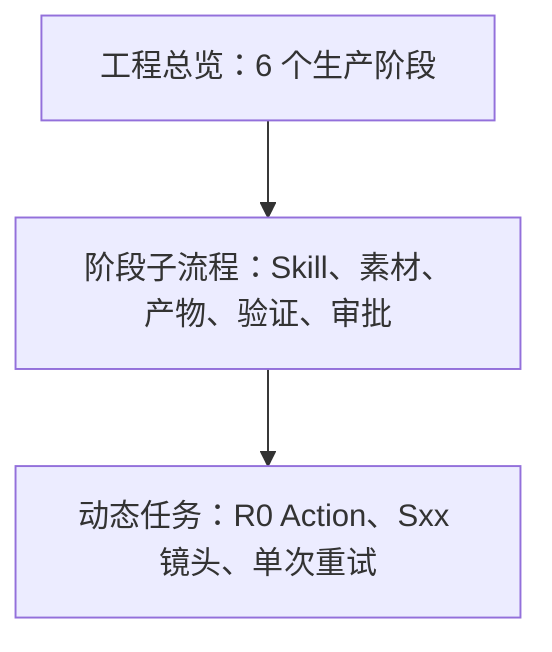
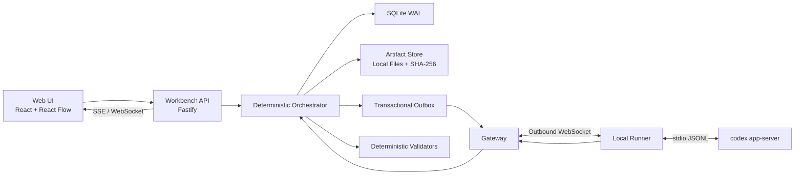
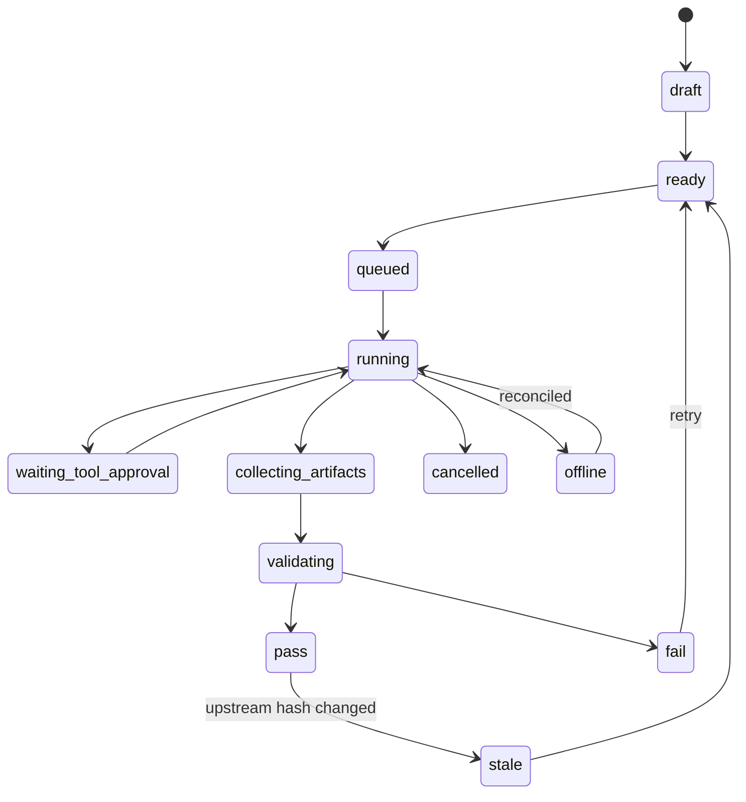

# 柠萌旅行记 Agent 工作台：客观评估与技术方案

> 版本：V1.0
>
> 日期：2026-08-11
>
> 评估对象：现有《柠萌旅行记-可视化节点画布Agent方案》与 `remote-codex-control` MVP
>
> 本文目的：决定“是否值得继续、首版做什么、怎样实现才不会成为只有外观的画布”。

> 状态说明：本文是优化前的基线评估。其范围收敛、状态拆分、可执行图、Skill路由、幂等与安全建议已回写到《可视化节点画布Agent方案》V1.3；实施时以V1.3为当前方案，本文保留为决策依据。

---

## 1. 结论先行

### 1.1 决策

**有条件继续（Conditional GO）。**

这个工作台确实对应一个真实问题：长流程脚本与视觉生产容易漏步骤、漏素材、漏检查，且用户很难判断 AI 当前正在做什么、为什么被阻塞、产物来自哪里。

但是，当前方案同时包含了三类产品：

1. Agent 执行与监控台；
2. 固定生产流程编排器；
3. 通用无限画布/低代码流程编辑器。

三者同时进入首版，会明显放大开发和验证成本。建议首版只做前两项，并把第三项限制为“查看、展开、调整视图”，暂不支持任意修改生产流程。

### 1.2 核心判断

画布不是解决漏内容的核心，以下四项才是：

- 确定性状态机；
- 输入、输出和产物清单契约；
- 可机器判定的 Gate；
- 全程可追溯、可恢复的执行事件。

画布的职责是让这四项一目了然。如果没有后端契约，画布只能展示“看起来执行过”；如果契约完整，即使暂时没有华丽画布，也能阻止漏流程。

### 1.3 首版产品定位

首版应定义为：

> **柠萌旅行记生产流程的可视化执行工作台**，而不是通用 Agent 节点编辑器。

默认进入“执行视图”：流程结构锁定，只允许运行、重试、中断、审批、补充素材和查看证据。模板编辑器留到流程稳定后再做。

---

## 2. 客观评分

| 维度 | 评分 | 判断 |
|---|---:|---|
| 问题匹配度 | 9/10 | 直接解决漏阶段、漏素材、状态不透明和错误交付 |
| 用户价值 | 8/10 | 对长流程生产很有价值，尤其适用于多轮脚本与视觉制作 |
| 技术可行性 | 8/10 | React Flow、事件流、Codex app-server 均可支撑 |
| 现有资产复用度 | 7/10 | Gateway、Runner、CodexClient 可复用，但持久化层需重做 |
| 数据契约成熟度 | 5/10 | 现有流程描述较完整，但各 Skill 的机器输入/输出契约仍需固化 |
| MVP 范围控制 | 5/10 | 23 阶段、10 类节点和自由编辑同时实现会过重 |
| 可靠性准备度 | 5/10 | JSONL + 内存状态不足以承担可靠工作台 |
| 安全与运维准备度 | 5/10 | 当前 MVP 更适合本机单用户，不适合直接公网部署 |
| 长期扩展性 | 8/10 | 以契约、事件和工作流版本为核心后可扩展至其他内容工程 |

**综合：7/10。** 值得继续，但必须先收窄首版，并优先构建执行真相层。

---

## 3. 现有方案哪些正确

### 3.1 正确的产品方向

- 把每个阶段的 Skill、素材引用、输入、输出、状态和 Gate 放在同一视图中；
- 将人工确认作为正式节点，而不是聊天中的临时一句话；
- 区分执行节点、产物节点、验证节点和审批节点；
- 用父阶段与子流程降低 23 个阶段同时展示的认知负担；
- 保留 Codex 线程和 Turn 的实时过程、审批与中断能力；
- 通过产物依赖追踪，防止上游已变、下游仍显示有效。

### 3.2 视觉参考可以借鉴的部分

用户提供的图片适合作为视觉和操作语言参考：

- 深色点阵无限画布；
- 不同用途节点采用不同内部布局；
- 节点端口与连线关系直观；
- 素材预览、参数和动作集中在节点卡片；
- 右键或快捷方式添加上下文相关内容。

但不应照搬图片中的“任意图像生成工作流”业务结构。柠萌旅行记的画布首先是有严格顺序和 Gate 的生产流程，而非自由拼接模型节点。

---

## 4. 现有方案的问题与风险

### 4.1 最大产品风险：画布先于契约

如果节点只保存标题、状态和几条文字，AI 即使遗漏文件，节点仍可能被标成完成。必须由验证器根据真实文件、结构化清单和哈希计算状态，不能以 Codex 的自然语言“已完成”为准。

### 4.2 自由编辑会破坏流程完整性

允许用户随意删除 Gate、跨阶段连线或绕过人工审批，会与“防遗漏”的核心目标冲突。

建议：

- 执行视图默认锁定结构；
- 只允许添加素材、备注、人工任务和受约束的补充动作；
- 模板编辑需要单独权限、版本发布和静态检查；
- 已开始的工程固定绑定 `workflowVersion`，不能被模板修改原地影响。

### 4.3 23 阶段全部铺开会造成信息过载

数据上保留 23 个阶段，视觉上默认合并为 6 个 Frame：

1. 方向与脚本；
2. 清单与 R0；
3. 分镜准备；
4. 草稿与定稿；
5. 静态与视频；
6. 资产归档与验收。

用户放大、双击或点击 Frame 后再展开内部节点。动态镜头任务作为阶段子节点生成，不占据总览主干。

### 4.4 Codex 完成不等于业务通过

必须拆分三种结果：

- `turnCompleted`：Codex 本次 Turn 已结束；
- `artifactCollected`：预期产物已被发现并登记；
- `validationPassed`：业务验证器判定产物满足 Gate。

只有第三项可以令节点进入 `pass`。

### 4.5 现有 Remote Codex Control 的边界

可直接复用：

- 浏览器与本机 Runner 分离；
- Gateway 命令转发和事件流；
- Codex thread/turn 的启动、恢复、中断和 steer；
- 审批请求转发；
- cwd 白名单与重连框架。

需要替换或增强：

- 内存 `TaskStore` 改为持久化工作流状态；
- JSONL 不能继续作为主要查询数据库；
- 事件序列需要项目级游标和幂等键；
- Codex thread/turn 需要与 `nodeRun` 显式绑定；
- 增加产物收集、哈希、验证、Gate 和失效传播；
- 增加断电恢复、孤儿运行检测和重连后的状态对账；
- 若走公网，补充身份认证、设备撤销、速率限制和审计。

### 4.6 本地 SQLite 的版本要求

本地单机方案适合使用 SQLite WAL，但工程必须固定到已修复 WAL-reset 问题的 SQLite 版本：**3.51.3 或官方已回移修复的 3.50.7 / 3.44.6 及以上对应补丁版**。数据库文件、`-wal` 和 `-shm` 必须位于同一台机器的本地文件系统，不能放网络盘。

---

## 5. 推荐产品结构

### 5.1 三层信息架构



### 5.2 主界面

- 顶栏：工程、工作流版本、整体进度、运行/暂停、搜索；
- 左侧：工程文件、素材、节点目录和问题列表；
- 中央：无限画布；
- 右侧：当前节点详情、输入输出、Skill、运行参数、验证结果；
- 底部抽屉：Codex 实时事件、命令审批、日志、文件变更和错误。

### 5.3 两种模式

**执行模式（MVP）**

- 工作流拓扑锁定；
- 可运行、重试、中断、审批、上传/引用素材；
- 可创建备注、补充素材和受约束的人工任务；
- 自动提示唯一或有限的可执行下一步。

**模板模式（后续）**

- 修改节点、端口、Gate 和依赖；
- 保存草稿、静态检查、发布新版本；
- 禁止直接修改已启动工程所绑定的版本。

### 5.4 右键添加设计原则

右键菜单必须由上下文决定，而不是始终显示完整节点库：

- 空白处：添加素材、备注、人工任务、进入模板编辑；
- 节点上：运行、重试、查看证据、复制引用、创建受约束后续任务；
- 端口上：只显示类型兼容的目标；
- Frame 内：只显示该阶段允许的动态任务类型；
- 执行模式下不得添加或删除核心 Gate。

---

## 6. 推荐技术架构



### 6.1 前端

| 领域 | 推荐选型 | 用途 |
|---|---|---|
| 基础框架 | React + TypeScript + Vite | 单页 Web 工作台 |
| 画布 | `@xyflow/react` | 节点、端口、边、Frame、MiniMap、缩放 |
| 自动布局 | ELK.js Web Worker | 阶段展开、子流程和复杂有向图排版 |
| 服务端状态 | TanStack Query | 工程、运行、产物、审批的缓存与重取 |
| 本地交互状态 | Zustand | 选择、视口、面板、临时拖拽、过滤器 |
| 契约校验 | Zod + JSON Schema | 前后端共享命令和事件结构 |
| 虚拟化 | React Window 类方案 | 长事件流、产物列表和问题列表 |

重要约束：

- 节点运行状态以服务器快照为准，不能由 Zustand 独立保存；
- 图片只渲染缩略图，原图按需加载；
- 总览默认只渲染阶段摘要，动态任务在展开时加载；
- ELK 布局在 Web Worker 中运行，避免阻塞画布交互；
- 节点组件使用稳定 props 和 memo，避免事件流导致整张画布重渲染。

### 6.2 后端

推荐延续现有 TypeScript/Node.js 技术栈，以减少 Gateway/Runner 的重写成本。

- Fastify：HTTP API、Schema 校验、鉴权钩子和 WebSocket/SSE 接入；
- 自研确定性 orchestrator：首版流程固定，不需要引入 Temporal；
- SQLite WAL：本机单用户的事务状态和事件索引；
- 本地文件系统：图片、脚本、分镜和较大日志；
- SHA-256：产物身份、缓存键、审批绑定和下游失效判断；
- transactional outbox：确保“状态已提交”和“命令待发送”不会二选一丢失。

### 6.3 为什么首版不使用 Temporal、PostgreSQL 和 Redis

首版是本机单用户 Web，固定流程数量有限。直接引入分布式工作流基础设施会增加部署、迁移和排障成本，却不能替代业务 Gate 的定义。

升级条件：

- 多用户并发或多个 Runner；
- 需要跨机器高可用；
- 单个任务可运行数小时且必须服务器接管重试；
- 事件吞吐或项目数量超出单机 SQLite 的合理范围。

满足条件后再迁移至 PostgreSQL + Redis Streams/队列 + 对象存储，工作流契约和 API 无需推翻。

---

## 7. 核心领域模型

### 7.1 必要实体

| 实体 | 关键字段 |
|---|---|
| Project | `id`, `name`, `rootPath`, `workflowVersionId`, `status` |
| WorkflowVersion | `id`, `schemaVersion`, `definitionHash`, `publishedAt` |
| NodeDefinition | `id`, `type`, `skillRef`, `inputContract`, `outputContract`, `gatePolicy` |
| EdgeDefinition | `source`, `sourcePort`, `target`, `targetPort`, `dataType` |
| NodeRun | `id`, `nodeId`, `attempt`, `status`, `inputSnapshotHash`, `codexBinding` |
| Artifact | `id`, `path`, `mediaType`, `sha256`, `size`, `producerRunId` |
| Validation | `id`, `runId`, `validator`, `status`, `evidence`, `ruleVersion` |
| Approval | `id`, `kind`, `actionHash`, `status`, `decidedBy`, `expiresAt` |
| Event | `seq`, `projectId`, `type`, `entityId`, `payload`, `occurredAt` |
| ViewState | `projectId`, `userId`, `viewport`, `expandedFrames`, `positions` |

### 7.2 状态机



业务人工确认使用独立的 `waiting_business_approval`，不能与 Codex 的命令/文件审批混为一类。

### 7.3 端口类型

建议首版固定以下类型：

- `text/script`：脚本正文；
- `text/prompt`：提示词；
- `application/checklist+json`：检查清单；
- `application/storyboard+json`：结构化分镜；
- `image/reference`：参考图；
- `image/storyboard`：分镜图；
- `video/clip`：视频片段；
- `application/validation+json`：验证报告；
- `application/approval+json`：业务确认凭证；
- `application/receipt+json`：执行凭证。

边只表达数据依赖。视觉顺序不能代替真实依赖。

---

## 8. Skill 与产物契约

每个可执行节点必须有一份版本化 `NodeDefinition`：

```json
{
  "id": "script.evaluate",
  "version": "1.0.0",
  "skillRef": "designing-travel-comedy-series/...",
  "inputs": [
    { "name": "script", "type": "text/script", "required": true },
    { "name": "rules", "type": "application/checklist+json", "required": true }
  ],
  "outputs": [
    { "name": "report", "type": "application/validation+json", "required": true }
  ],
  "completion": {
    "requiredFiles": ["node-result.json", "evaluation.md"],
    "validators": ["json-schema", "script-coverage", "file-exists"]
  }
}
```

每次 Skill 运行必须输出 `node-result.json`，至少包含：

- NodeDefinition 版本；
- 输入产物 ID 与哈希；
- 输出文件清单；
- 使用的参考素材；
- 执行摘要；
- 结构化警告和错误；
- Codex thread/turn ID；
- 开始、结束时间；
- 建议状态，但最终状态由 orchestrator 计算。

---

## 9. 执行事务

一次“运行节点”按以下顺序进行：

1. API 校验用户权限、节点状态、前置 Gate 和输入完整性；
2. 在单个数据库事务中创建 `NodeRun`、冻结输入快照并写入 outbox；
3. dispatcher 把 outbox 命令交给 Gateway/Runner；
4. Runner 启动或恢复 Codex thread，并绑定 `nodeRunId`；
5. 原始 Codex 事件进入事件表和实时推送，但不直接改变业务 PASS；
6. Turn 结束后，Artifact Collector 只从该运行的允许输出目录收集产物；
7. 验证器检查文件、Schema、数量、引用覆盖率和业务规则；
8. orchestrator 原子提交 `pass`、`fail` 或等待业务审批；
9. 如果产物哈希变化，所有使用旧哈希的下游运行进入 `stale`；
10. UI 收到同一项目递增序号事件，增量刷新节点和证据面板。

### 9.1 幂等与恢复

- 每个运行命令带 `idempotencyKey`；
- 同一节点同一输入哈希不得并发创建两个普通运行；
- Gateway 重发事件以 `(source, sourceEventId)` 去重；
- 服务重启后从数据库恢复，而不是依赖进程内对象；
- 对 `running` 节点执行 Runner/Codex 对账，无法确认的标记为 `offline`，不得自动判成功；
- 重试创建新 attempt，保留旧运行和旧产物，不覆盖历史证据。

---

## 10. API 与事件

### 10.1 建议 API

```text
POST   /api/projects
POST   /api/projects/:projectId/import
GET    /api/projects/:projectId/graph
GET    /api/projects/:projectId/problems
POST   /api/nodes/:nodeId/runs
POST   /api/runs/:runId/interrupt
POST   /api/runs/:runId/retry
POST   /api/approvals/:approvalId/decision
GET    /api/runs/:runId/events?afterSeq=...
GET    /api/artifacts/:artifactId
GET    /api/artifacts/:artifactId/preview
GET    /api/events?projectId=...&afterSeq=...
WS     /ws/projects/:projectId
```

命令使用 POST；实时流只传状态变化。浏览器断线后先用 `afterSeq` 补事件，再恢复 WebSocket。

### 10.2 事件命名

```text
project.created
workflow.instantiated
node.ready
node.run.queued
node.run.started
codex.turn.started
codex.item.updated
approval.requested
approval.decided
artifact.collected
validation.completed
node.run.passed
node.run.failed
node.invalidated
runner.offline
runner.reconciled
```

### 10.3 Codex 适配边界

- 浏览器只连接工作台 API，不直接连接 `codex app-server`；
- 继续使用 stdio JSONL 作为 Runner 与 app-server 的默认稳定路径；
- app-server 的实验性 WebSocket 不作为生产依赖；
- 每个已安装 Codex 版本执行 `codex app-server generate-json-schema`，保存对应协议快照；
- Adapter 负责把 Codex 协议变化隔离成内部统一事件；
- 对 app-server `server overloaded` 类错误采用带 jitter 的指数退避，不得无限快速重试。

---

## 11. 安全方案

本机单用户也应建立以下边界：

- API 默认仅监听 `127.0.0.1`；
- Runner 使用短期注册令牌，支持设备撤销；
- 工程根目录使用 canonical path 白名单；
- 拒绝 `..` 穿越、越界绝对路径和指向白名单外的符号链接；
- 每个节点仅能写入自己的 attempt 输出目录；
- Secret 只保存在 Runner/系统密钥设施，不下发浏览器；
- Codex 命令审批与业务内容审批分离展示；
- 审批绑定 `actionHash` 或 `artifactHash`，内容变化后旧审批自动失效；
- 所有运行、审批、删除、导入和模板发布写入审计事件；
- 公网部署前必须增加 TLS、用户认证、RBAC、CSRF/Origin 防护、速率限制和审计保留策略。

---

## 12. 首版范围

### 12.1 必须做

- 创建工程或导入既有 EP；
- 加载锁定的工作流版本；
- 6 个 Frame 总览和阶段内节点展开；
- 节点详情：Skill、输入、素材、输出、Gate、历史运行；
- 运行、重试、中断、命令审批、业务确认；
- 实时事件和断线续传；
- 产物清单、缩略图、哈希与来源；
- 至少覆盖“脚本 → 检查 → 分镜草稿 → 定稿”的关键链路；
- 缺失检测、上游变更失效和重启恢复；
- 手动挂接/导入历史产物。

### 12.2 明确不做

- 任意删除或跨越核心 Gate；
- 通用低代码模板编辑器；
- 多人实时协同；
- 公网 SaaS；
- 插件市场；
- 任意模型供应商编排；
- 第一版完整自动化全部 23 个阶段；
- Redis、Kubernetes 或分布式工作流引擎。

---

## 13. 分阶段交付

### Phase 0：契约与导入验证

- 固化工作流版本格式；
- 为首条关键链路定义 NodeDefinition；
- 定义 `node-result.json`；
- 扫描一个现有 EP，生成产物 manifest 和缺失报告；
- 用 CLI 验证 Gate，不做画布运行。

**退出标准：** 同一项目重复扫描结果稳定，能准确报告缺失和陈旧产物。

### Phase 1：只读执行画布

- 建立 React Flow 总览、Frame、节点详情和问题列表；
- 接入 SQLite 快照与事件查询；
- 支持导入工程、查看证据和定位阻塞；
- 使用 mock run 验证前端状态机。

**退出标准：** 用户不打开文件夹即可判断当前进度、下一步和阻塞原因。

### Phase 2：单节点真实执行

- 复用 Gateway/Runner/CodexClient；
- `nodeRun` 与 thread/turn 绑定；
- 支持运行、中断、实时事件和命令审批；
- 运行结束后收集产物并执行验证器。

**退出标准：** Codex 即使文字声称完成，只要缺少产物，节点仍会失败。

### Phase 3：Gate、审批与恢复

- 业务确认节点；
- 下游失效传播；
- 服务重启恢复和孤儿任务对账；
- 幂等运行、重试历史、审计记录。

**退出标准：** 在中断、重启、重复点击和上游改稿情况下仍不会误判完成。

### Phase 4：完整流程与高级画布

- 逐步覆盖其余阶段；
- 动态 Sxx/R0 子节点；
- 语义缩放、自动布局、批量问题处理；
- 受约束的右键添加。

### Phase 5：可选平台化

- 模板编辑器和发布审批；
- 多用户、权限和远程 Runner；
- PostgreSQL、队列和对象存储；
- 其他内容生产工程模板。

---

## 14. 验收矩阵

| 场景 | 预期结果 |
|---|---|
| Codex 返回“完成”但缺 `node-result.json` | 节点失败，不解锁下游 |
| 分镜要求 12 镜但只生成 11 张 | 数量验证失败，明确指出缺失镜头 |
| 修改脚本后未重做分镜 | 原分镜及下游进入 `stale` |
| 重复点击运行 | 幂等拒绝或聚焦已有运行 |
| Gateway 重复发送事件 | 事件去重，状态只推进一次 |
| 服务在运行中重启 | 恢复后进入对账，不误判 PASS |
| 审批后产物被修改 | 原审批失效，重新请求确认 |
| 文件通过符号链接指向工程外 | 收集器拒绝并记录安全事件 |
| R0 Action 连接到 Sxx 专用输入 | 端口类型检查拒绝 |
| 展开大量动态镜头 | 主线程保持可交互，按阶段按需加载 |
| 用户从断线后序号重新连接 | 补齐缺失事件，无状态跳跃 |

---

## 15. 最终建议

### 15.1 可以继续的条件

继续执行前，先确认以下四项为首版原则：

1. 产品是本机单用户 Web 执行工作台；
2. 默认锁定流程，不做通用节点编辑器；
3. 先完成契约、验证和恢复，再扩展视觉能力；
4. 首条端到端链路只覆盖脚本到分镜定稿，不一次性自动化全部阶段。

### 15.2 推荐的下一步

下一步不应先堆更多节点样式，而应产出三个可执行工件：

1. `workflow.schema.json`：工作流、节点、边、端口和 Gate；
2. `node-result.schema.json`：每次 Skill 执行的标准收据；
3. 一个既有 EP 的 `project-manifest.json`：真实素材、产物、哈希和缺失项。

这三个工件通过实际工程验证后，再搭建 React Flow 前端骨架。这样前端展示的是可验证的真实状态，不是人工维护的流程图。

---

## 16. 技术依据

- React Flow 官方支持通过 `parentId` 构建子流程与分组，适合阶段 Frame 与内部节点展开：<https://reactflow.dev/learn/layouting/sub-flows>
- React Flow 官方性能指南：<https://reactflow.dev/learn/advanced-use/performance>
- ELK.js 是独立图布局引擎并支持 Web Worker，适合复杂有向流程的异步自动布局：<https://github.com/kieler/elkjs>
- Codex app-server 官方说明其 JSON-RPC、stdio JSONL、thread/turn、事件和审批能力，同时将 WebSocket 标注为实验性：<https://github.com/openai/codex/blob/main/codex-rs/app-server/README.md>
- SQLite WAL 官方文档说明其本机并发优势、网络文件系统限制以及 2026 WAL-reset 修复版本：<https://sqlite.org/wal.html>
- Fastify 官方服务器文档：<https://fastify.dev/docs/latest/Reference/Server/>
- TanStack Query React 官方文档：<https://tanstack.com/query/latest/docs/framework/react/overview>
