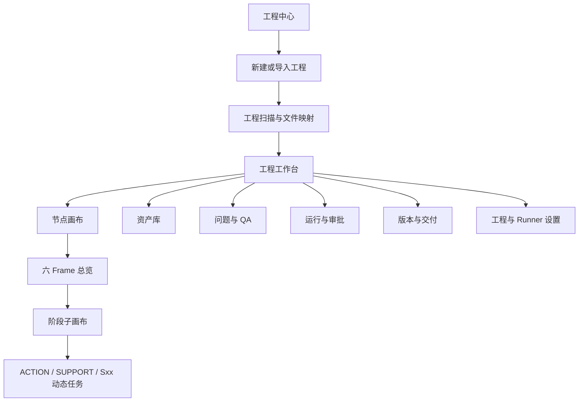
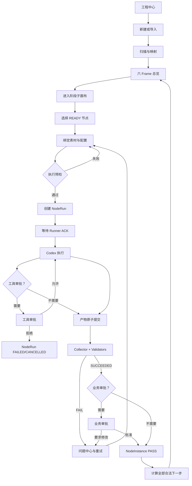

# 柠萌旅行记 Agent 工作台完整交互方案

版本：V1.0

日期：2026-08-11

关联文档：

- 《可视化节点画布 Agent 方案》V1.3
- 《Agent 工作台客观评估与技术方案》V1.0

## 1. 结论

完整产品应采用：

> 多视图 Web 工作台 + 无限节点画布核心工作区 + 上下文检查器、运行抽屉与审批弹层。

无限节点画布是 Agent 生产与流程执行的核心界面，但不能承担工程管理、批量资产管理、问题诊断、审批队列、版本影响分析、Runner 设置和最终交付等全部工作。

用户提供的深色节点画布截图主要约束以下界面：

- 六 Frame 工程总览；
- 阶段节点画布；
- 节点内部素材、配置、执行和产物交互；
- 端口连接、右键添加、MiniMap 和语义缩放。

其他场景应采用更合适的标准 Web 交互，不能为保持“全画布”而牺牲效率和清晰度。

## 2. 设计原则

### 2.1 画布是生产空间，不是全部导航

- 节点直接承载高频输入、配置、运行和产物预览。
- 工程、资产、问题、审批和历史提供独立视图。
- 用户可以从独立视图定位回画布节点，也可以从节点打开对应完整记录。

### 2.2 直接操作优先，深层证据按需展开

- 节点内部：素材槽位、常用参数、状态、运行、重试和产物摘要。
- 右侧检查器：完整哈希、NodeDefinition、Skill 路由、验证证据和历史尝试。
- 底部抽屉：当前 NodeRun 的实时事件、命令、文件变化和审批请求。
- 独立页面：跨节点、跨阶段和跨版本的批量管理。

### 2.3 状态必须来源于后端真相层

- UI 不根据 Codex 自然语言把节点标成 PASS。
- 节点状态来自 NodeInstance 投影。
- 运行状态来自 NodeRun 投影。
- 产物、验证与审批分别显示，不合并成模糊的“完成”。

### 2.4 推荐下一步不隐藏合法并行任务

- 顶部显示一个推荐下一步。
- 同时提供“全部合法下一步”入口。
- 并行 READY 节点必须可见，不能为了简化 UI 伪装成唯一串行流程。

### 2.5 参考图只决定画布语言

画布沿用参考图的：

- 深色点阵无限空间；
- 大小不一的富内容节点；
- 节点内直接配置和执行；
- 曲线连线与明确端口；
- 空间化 Frame；
- 右键菜单和浮动节点工具栏。

不沿用参考图的图像生成业务结构，也不把所有 Web 页面都强行画布化。

## 3. 产品信息架构

### 3.1 一级入口

| 一级入口 | 主要任务 | 是否使用无限画布 |
|---|---|---|
| 工程中心 | 查找、创建、导入和恢复工程 | 否 |
| 工作台 | 进入当前工程并查看整体状态 | 混合 |
| 节点画布 | 流程理解、节点操作和 Agent 执行 | 是 |
| 资产库 | 批量搜索、导入、版本和引用管理 | 否 |
| 问题与 QA | 聚合缺失、失败、STALE 与安全问题 | 否 |
| 运行与审批 | 运行历史、工具审批和业务审批 | 否 |
| 版本与交付 | 版本比较、影响分析、验收和导出 | 否 |
| 设置 | 工程目录、Runner、备份和安全 | 否 |

## 4. 全局 Web 框架

### 4.1 顶部项目栏

所有工程内页面共享：

- 工程切换器：系列、集号和版本；
- 当前 Workflow 版本与哈希；
- 工程整体状态；
- 推荐下一步；
- 全部合法下一步；
- Runner 在线/离线状态；
- 全局搜索；
- 通知、审批和设置入口。

顶部栏保持紧凑，不展示大段统计信息。

### 4.2 可折叠图标栏

工程内提供窄图标栏：

- 画布；
- 资产；
- 问题；
- 运行；
- 版本；
- 设置。

默认仅显示图标和未处理数量，用户主动展开时才显示文字。纯画布模式可完全收起。

### 4.3 上下文检查器

右侧检查器不是永久面板，只在选中节点、产物、问题或运行时出现。

检查器负责：

- 完整输入与输出；
- 文件哈希和版本；
- 实际 Skill 路由；
- NodeDefinition 与 Workflow 版本；
- Validator 证据；
- 当前及历史 NodeRun；
- 上下游依赖；
- 审批记录。

### 4.4 运行抽屉

底部抽屉仅在以下情况打开：

- 用户主动查看运行；
- NodeRun 正在执行；
- 收到工具审批请求；
- Runner 失联或执行失败。

收起后只保留状态条，不持续占据画布。

### 4.5 弹层与全屏任务

- 危险或不可逆决策：模态弹层。
- 需要大量对比的信息：独立页面或全屏任务层。
- 简短补充操作：Popover 或节点内展开。
- 不使用多层嵌套抽屉。

## 5. 完整交互场景

### 5.1 工程中心

用户进入 Web 后首先看到工程中心，而不是空画布。

#### 展示内容

- 最近工程；
- 工程进度；
- 当前阻断；
- 待业务审批数量；
- 活跃 NodeRun；
- Runner 状态；
- 最近更新时间。

#### 主要操作

- 继续上次工作；
- 新建 EP；
- 导入既有 EP；
- 打开只读工程；
- 定位待审批工程；
- 恢复异常工程。

#### 卡片状态

- 正常进行；
- 等待业务审批；
- 存在 FAIL；
- 存在 STALE；
- Runner 离线；
- 最终完成。

### 5.2 新建或导入工程

采用分步向导或聚焦面板，不在无限画布中完成全部系统配置。

#### 新建步骤

1. 输入系列、集号和目的地。
2. 选择工程目录。
3. 选择 Workflow 版本。
4. 绑定系列设定、角色设定、历史 EP 和地点资料。
5. 执行 Preflight。
6. 创建目录与 Workflow 快照。
7. 生成初始 `project-manifest.json`。

#### 导入步骤

1. 选择既有工程目录。
2. 只读扫描文件。
3. 识别已有脚本、素材、分镜和收据。
4. 进入文件映射页面。
5. 用户确认映射。
6. 创建工程实例，不直接把历史文件判为 PASS。

#### Preflight

- 目录可读写；
- Workflow Schema 可用；
- SQLite 运行时版本安全；
- Runner 可连接；
- Skill Route Registry 状态；
- 必要系列素材是否存在。

Preflight 未通过时允许保存工程草稿，但不允许进入执行模式。

### 5.3 工程扫描与文件映射

这是既有工程导入的必要步骤。

#### 映射表字段

- 文件名与预览；
- 检测类型；
- Artifact role；
- 建议阶段；
- 来源与信任等级；
- SHA-256；
- 引用位置；
- 冲突与缺失；
- 用户确认结果。

#### 文件分类

- 已验证产物；
- 普通历史文件；
- 重复文件；
- 无法识别文件；
- 缺少来源的文件；
- 声明存在但实际缺失；
- 指向工程目录外的非法引用。

#### 用户操作

- 修改 Artifact role；
- 绑定到正式节点；
- 标记为参考素材；
- 排除文件；
- 合并重复项；
- 创建缺失问题；
- 保存映射模板。

### 5.4 六 Frame 工程总览

进入工程后默认展示六个空间 Frame：

1. 方向与脚本；
2. 清单与 R0；
3. 分镜准备；
4. 分镜定稿；
5. 视频与交付；
6. 归档与验收。

#### Frame 摘要

- 内部阶段范围；
- PASS/总数；
- READY 数量；
- FAIL、BLOCKED 和 STALE 数量；
- 当前推荐节点；
- 待审批数量；
- 最近产物缩略图。

#### 操作

- 单击：选择 Frame 并显示摘要；
- 双击：进入阶段子画布；
- 右键：只显示合法的 Frame 操作；
- 聚焦阻断：只高亮失败链；
- 查看全部合法下一步；
- 返回上次视口。

Frame 自身不能手工 PASS，也不能绕过内部 Gate。

### 5.5 阶段节点画布

这是参考图视觉语言的主要应用场景。

#### 节点内直接操作

- MATERIAL：上传、拖入、替换和预览素材；
- CONFIG：编辑开放参数、Prompt 和执行配置；
- SKILL_RUN：查看 operation、输入、输出契约并运行；
- ARTIFACT：预览当前产物、覆盖范围和版本；
- VALIDATOR：执行或重新执行确定性检查；
- GATE：展示通过条件和阻断项；
- APPROVAL：展示确认范围并进入正式审批；
- RECEIPT：查看不可变执行证据。

#### 节点选择

- 单击：选中并显示浮动工具栏；
- 双击：展开节点或进入动态任务子画布；
- 右键：运行、重试、输入、产物、证据和定位上下游；
- Shift：多选素材或任务；
- 拖拽端口：只显示类型兼容的关系。

#### 空白画布右键

执行模式只允许：

- 添加素材节点；
- 添加备注；
- 添加人工任务；
- 挂接既有产物。

不提供添加 Skill、Gate、Control 或删除正式依赖。

### 5.6 资产库

资产库解决画布不适合承担的批量管理问题。

#### 查看方式

- 缩略图网格；
- 紧凑列表；
- 镜号矩阵；
- 引用关系视图。

#### 筛选维度

- Artifact role；
- 角色、场景、道具；
- Sxx/ACTION/SUPPORT；
- 生产节点；
- PASS、APPROVED、STALE 等状态；
- 文件类型；
- 使用范围；
- 版本和日期。

#### 操作

- 批量导入；
- 绑定节点；
- 替换版本；
- 查看使用位置；
- 对比版本；
- 晋升通用资产；
- 标记废弃；
- 拖入画布节点。

替换已被使用的资产前必须展示下游影响。

### 5.7 执行预检

用户点击“运行节点”后，不能立即把自由文本发给 Codex。

#### 预检弹层

- NodeDefinition 与 Workflow 版本；
- 实际 Skill 路由；
- 输入 Artifact 与哈希；
- 缺失输入；
- 允许写入目录；
- 预计输出；
- Validators；
- deadline 与最大重试；
- 当前 project revision；
- 是否需要工具审批或业务审批。

#### 操作

- 运行；
- 返回补充输入；
- 打开 Skill 详情；
- 复制执行信封；
- 取消。

预检失败时“运行”按钮禁用，并直接定位阻断输入。

### 5.8 Codex 运行与工具审批

运行开始后打开底部运行抽屉。

#### 运行阶段

1. NodeRun CREATED；
2. 等待 Runner ACK；
3. DISPATCHED；
4. Codex Turn RUNNING；
5. 等待工具审批；
6. 收集产物；
7. Validators；
8. SUCCEEDED 或 FAILED。

#### 运行抽屉

- 当前状态和心跳；
- Codex thread/turn；
- 增量消息；
- 命令与 cwd；
- 文件变化和 diff；
- 产物 staging 状态；
- Validator 进度；
- 中断按钮。

#### 工具审批

审批请求必须显示：

- 命令或文件变更；
- cwd；
- actionHash；
- 风险原因；
- 允许一次；
- 本次会话允许；
- 拒绝；
- 取消运行。

工具审批不能替代业务内容确认。

### 5.9 Validator 失败与重试

NodeRun 完成后先进入产物收集和验证，不能直接显示 NodeInstance PASS。

#### 失败反馈

- 节点边框和状态显示 FAIL；
- 失败连线变红；
- 下游 Gate 显示 BLOCKED；
- 节点内展示最重要缺口；
- 问题中心创建结构化 Problem；
- 保留旧产物和完整证据。

#### 用户处理路径

- 修复输入；
- 只重新验证；
- 创建新 NodeRun；
- 查看上一次尝试；
- 对比两次输出；
- 标记无法解决并暂停阶段。

普通重试默认创建新 Codex thread。只有明确选择“基于本次结果返工”时才恢复或 fork 旧上下文。

### 5.10 业务审批

业务审批提供独立界面，不只在节点上显示两个按钮。

#### 审批类型

- 方向确认；
- 脚本确认；
- 静态分镜确认；
- 最终验收。

#### 审批界面

- 确认范围；
- 产物预览；
- 输入与产物哈希；
- 与上一版本差异；
- Validator 报告；
- 未解决警告；
- 上下游影响；
- 批准；
- 拒绝；
- 要求修改并指定返工节点。

任何绑定哈希变化后，原审批自动 EXPIRED。

### 5.11 问题与 QA 中心

#### 问题类型

- 缺失素材；
- 缺失镜号；
- Schema 错误；
- 重复镜号；
- 悬空引用；
- 连续性问题；
- Skill Route 不可用；
- Runner LOST；
- 路径越界；
- STALE 依赖；
- 审批过期。

#### 问题操作

- 定位到画布；
- 打开证据；
- 修复映射；
- 重新验证；
- 创建重试；
- 批量处理同类问题；
- 标记已接受风险。

接受风险不能绕过核心硬 Gate。

### 5.12 上游修改与 STALE 影响分析

用户修改已被使用的脚本或素材时，先显示影响分析。

#### 影响分类

- 必须重跑；
- 可以重新验证；
- 不受影响；
- 需要重新审批。

#### 操作流程

1. 展示修改前后哈希与差异。
2. 展示受影响节点和产物。
3. 用户确认修改。
4. 创建新 Artifact 版本。
5. 依赖旧哈希的节点进入 STALE。
6. 原审批进入 EXPIRED。
7. 推荐最小返工起点。

旧产物不删除，只退出当前有效链。

### 5.13 版本历史与恢复

#### 展示内容

- Workflow 版本；
- 项目 revision；
- 脚本和资产版本；
- 每个 NodeRun 尝试；
- 审批历史；
- STALE 传播记录；
- Runner 断线和恢复事件。

#### 恢复语义

- 恢复是创建新当前版本，不覆盖历史；
- LOST NodeRun 不推测成功；
- 从历史产物恢复后重新验证；
- 不提供虚假的 Codex Turn 内暂停/检查点恢复。

### 5.14 最终验收与交付

#### 验收摘要

- 23 阶段状态；
- 全部硬 Gate；
- 未解决 Problem；
- 待审批项；
- STALE 节点；
- 产物覆盖率；
- 资产晋升；
- 项目地图状态。

#### 交付内容

- 正式脚本；
- Checklist；
- 文字分镜；
- R0 资产；
- 草图与真实分镜；
- Seedance 包；
- 完整使用指引；
- Artifact manifest；
- 审批与最终验收收据。

#### 操作

- 运行最终验收；
- 查看缺失项；
- 导出交付包；
- 打开工程目录；
- 标记工程完成；
- 返回继续修复。

## 6. 端到端主流程

## 7. 画布内外职责边界

| 能力 | 节点内部 | 检查器/抽屉 | 独立页面 |
|---|---|---|---|
| 单次素材绑定 | 主要 | 完整属性 | 资产库批量管理 |
| 高频配置 | 主要 | 高级配置 | 不需要 |
| 运行/中断/重试 | 主要 | 实时详情 | 运行历史 |
| 当前产物预览 | 主要 | 完整证据 | 资产库版本管理 |
| 当前错误 | 简短摘要 | 完整诊断 | 问题中心聚合 |
| 工具审批 | 状态提示 | 运行抽屉/弹层 | 审批历史 |
| 业务审批 | 入口与状态 | 不承载正式决策 | 独立审批界面 |
| 上下游影响 | 高亮路径 | 当前依赖 | STALE 影响分析 |
| 工程配置 | 不承载 | 不承载 | 设置页面 |
| 最终交付 | 状态入口 | 不承载 | 验收与交付页面 |

## 8. 状态反馈规范

### 8.1 NodeInstance

- LOCKED：灰色，依赖未满足；
- READY：白色轮廓，可执行；
- ACTIVE：蓝色，显示当前 NodeRun 徽标；
- WAITING_BUSINESS_APPROVAL：黄色；
- PASS：绿色；
- FAIL：红色；
- BLOCKED：紫色；
- STALE：橙色斜纹。

### 8.2 NodeRun

NodeRun 状态作为次级徽标显示：

- DISPATCH_PENDING；
- DISPATCHED；
- RUNNING；
- WAITING_TOOL_APPROVAL；
- COLLECTING_ARTIFACTS；
- VALIDATING；
- SUCCEEDED；
- FAILED；
- TIMED_OUT；
- CANCELLED；
- LOST。

NodeRun SUCCEEDED 不等于 NodeInstance PASS。

### 8.3 全局反馈

- Toast：短暂成功、保存和连接提示；
- Banner：Runner 离线、数据库只读等持续系统问题；
- Inline error：字段或节点输入错误；
- Problem：需要后续处理的结构化业务问题；
- Modal：审批、失效确认和危险操作。

## 9. 异常与恢复交互

### 浏览器刷新

- 从服务器恢复项目快照；
- 使用 `afterSeq` 补齐事件；
- 恢复画布视口和 Frame 展开状态；
- 不从前端缓存推测节点状态。

### 多标签页冲突

- 所有状态命令携带 `expectedRevision`；
- 冲突时返回 409；
- 显示最新状态与用户刚才操作的差异；
- 用户刷新后重新提交。

### Runner 失联

- 活跃 NodeRun 显示连接异常；
- 超过对账期限进入 LOST；
- NodeInstance 进入 BLOCKED；
- 用户可重新连接、对账或创建新运行；
- 迟到事件不能覆盖新 generation。

### 磁盘或路径异常

- 禁止收集目录外文件；
- staging 未完整提交时不展示为有效产物；
- 磁盘不足时停止执行并保留诊断；
- 不自动删除旧产物。

## 10. 键盘、无障碍与响应式

### 键盘

- Space + 拖动：移动画布；
- 滚轮/触控板：缩放；
- Enter：打开选中节点；
- Escape：关闭菜单、检查器或弹层；
- Delete：执行模式下不能删除正式节点；
- `/`：全局搜索；
- 方向键：移动右键菜单选项。

### 无障碍

- 状态不能只靠颜色；
- 所有按钮提供文字或可访问名称；
- 节点可以通过列表替代视图访问；
- 画布提供“当前路径”“阻断项”“全部合法下一步”的文本列表；
- 审批与问题处理不依赖拖拽。

### 响应式

- 主要目标是桌面浏览器；
- 窄屏下检查器和运行抽屉改为全宽层；
- 移动端首版只提供查看、审批和中断，不提供复杂画布编辑；
- 不把桌面画布等比缩小到不可读。

## 11. MVP 交互范围

### 必须实现

- 工程中心；
- 新建/导入；
- 扫描与文件映射；
- 六 Frame 总览；
- 阶段节点画布；
- 资产搜索与单次绑定；
- 执行预检；
- NodeRun 实时抽屉；
- 工具审批；
- Validator 失败与重试；
- 业务审批；
- 问题中心；
- STALE 影响分析；
- 最终验收摘要。

### MVP 不实现

- 通用 Workflow 模板编辑器；
- 多人实时协作；
- 移动端复杂画布编辑；
- 任意 Skill 市场；
- 任意删除或绕过 Gate；
- 完整 SaaS 管理后台。

## 12. 完整交互稿清单

后续 ImageGen 或前端原型应按连续场景生成，不再只提供一张编辑界面：

1. 工程中心；
2. 新建/导入工程；
3. 工程扫描与文件映射；
4. 六 Frame 工程总览；
5. 阶段节点编辑与右键添加；
6. 执行预检；
7. Codex 运行与工具审批；
8. Validator 失败与重试；
9. 业务审批；
10. STALE 影响分析；
11. 资产库；
12. 问题与 QA 中心；
13. 版本历史与恢复；
14. 最终验收与交付。

其中第 4、5、6、7、8 张重点继承用户参考图的无限画布和富内容节点语言；其他界面使用同一设计系统，但采用更适合任务的列表、表格、对比和审批布局。

### 当前已有视觉参考

- `docs/images/交互稿-02-新建导入工程.png`：新建工程、素材绑定与 Preflight 的早期视觉参考。
- `docs/images/节点画布Agent交互图-V1.3-参考图版.png`：阶段节点编辑、右键添加、Validator FAIL 与 Gate BLOCKED 的视觉参考。

两张图片只覆盖完整交互稿清单中的局部状态，不能作为全部前端页面范围。

## 13. 交互验收标准

- 用户从工程中心到创建第一个 NodeRun 不需要手动编辑工程文件。
- 导入历史 EP 时，任何无法证明来源的文件不会自动获得 PASS。
- 用户在总览中能同时看到推荐下一步和全部合法下一步。
- 用户可以在节点内完成单次素材绑定与运行，不必频繁切换页面。
- 批量资产和跨节点问题不强塞进画布节点。
- 工具审批与业务审批在位置、文案和数据模型上明确分离。
- Codex Turn 完成时 UI 不提前显示业务 PASS。
- Validator FAIL 后能从节点、问题中心和运行历史进入同一修复路径。
- 上游修改前必须看到 STALE 影响范围。
- Runner 失联、浏览器刷新和多标签页冲突不会造成重复运行或错误推进。
- 最终交付界面能明确指出缺失项、未审批项和 STALE 产物。
- 画布参考图的富节点交互得到保留，但不牺牲工程管理和批量任务效率。
