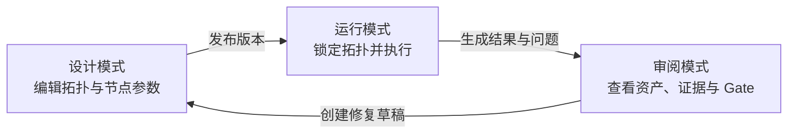
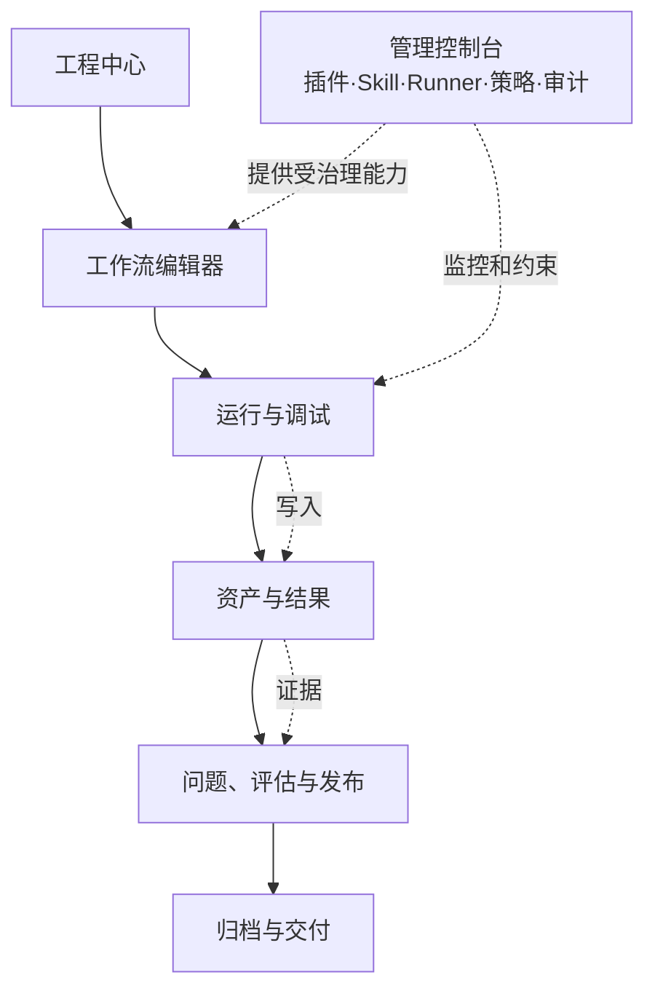
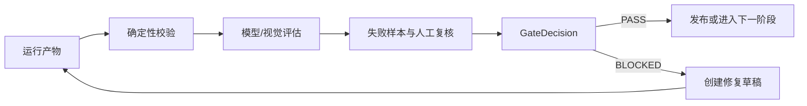
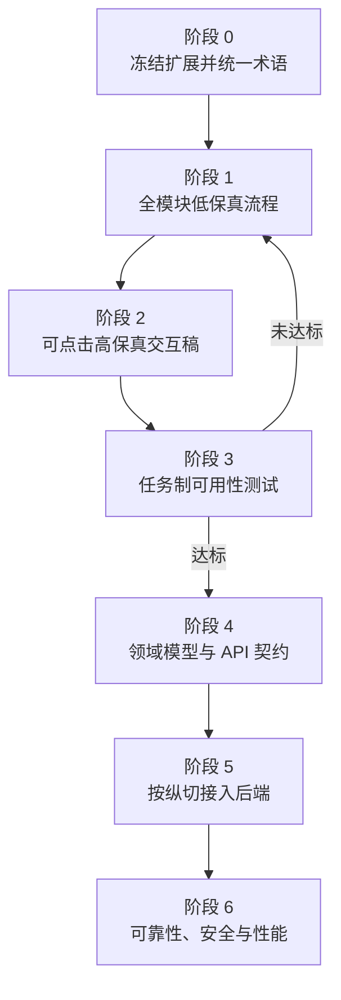

# 柠萌旅行记 Agent 工作台

## 节点画布产品完整性客观评估与交互优先方案

> 文档状态：产品纠偏基线  
> 适用对象：产品、交互、前端、后端、Agent/Skill/插件设计者、测试与验收人员  
> 核心决策：暂停扩展后端能力，先补齐并验证各模块的基础交互，再由稳定交互反推领域模型与接口。

---

## 1. 执行摘要

当前项目已经具备一条较强的技术纵切：NodeRun、事件流、Artifact、Gate、人工复核、Runner 与审计等后台概念已被实现或表达；但制作端节点画布仍然主要承担“展示既定流程与运行结果”的职责，没有形成完整的“创建—配置—连接—校验—运行—修复—复用”编辑闭环。

因此，当前产品不能被客观定义为“成熟的可视化 Agent 节点工作台”，更准确的阶段是：

> **具有真实执行链路的高保真纵切原型，但节点创作与工程管理能力仍处于概念验证阶段。**

当前最优策略不是继续增加 Runner、数据库或远程执行能力，而是先完成交互产品定义。若继续后端优先，会导致接口围绕临时界面固化，随后在节点类型、端口模型、草稿版本、资产绑定和运行范围上发生大规模返工。

### 1.1 本轮关键结论

1. 画布必须从“流程展示页”升级为“工作流编辑器”。
2. 工程管理、画布编辑、运行调试、结果审阅、平台管理必须形成连续导航，而不是三个相互独立的演示页面。
3. 设计态、运行态、审阅态必须分离，避免用户在执行过程中意外修改拓扑，也避免把节点配置与运行结果混在同一层级。
4. 图片与脚本不能只是节点装饰；它们必须成为可选择、可批量绑定、可比较、可追溯、可版本化的正式资产。
5. 插件与 Skill 管理要围绕“可被画布节点消费的 NodeDefinition”展开，而不是只展示注册表和转换结果。
6. 后端开发恢复的条件，是关键任务的可点击交互稿通过验收，而不是页面数量达到某个值。

---

## 2. 本次评估方法

本评估不以视觉完成度或页面数量作为主要标准，而采用五层产品完整性模型：

| 层级 | 核心问题 | 判定标准 |
|---|---|---|
| L1 信息可见 | 用户能否看懂当前工程、流程、节点、资产和状态 | 信息层级明确，关键对象可识别 |
| L2 基础操作 | 用户能否创建、编辑、连接、删除和恢复 | 操作闭环完整，有反馈与撤销 |
| L3 任务闭环 | 用户能否从目标出发完成一次生产或修复 | 可预检、运行、定位失败、修复、复检 |
| L4 系统治理 | 管理员能否配置插件、Skill、Runner、策略和审计 | 管理对象有生命周期、权限和验证 |
| L5 运行可信 | 执行是否可追踪、可恢复、可复现 | 输入快照、事件、产物、版本和收据完整 |

评估证据来自当前原型代码、已有文档和现有界面。评分表示“用户当前可完成程度”，不是对技术团队能力的评价。

---

## 3. 当前项目客观评分

评分范围：0 为没有定义，5 为有静态表达，10 为形成可用且可验证的闭环。

| 模块 | 当前评分 | 客观判断 | 主要证据或缺口 |
|---|---:|---|---|
| 产品信息架构 | 6/10 | 已区分制作、评估、管理，但缺少统一工程入口与对象关系 | 顶部工作区切换清晰；项目、工作流、版本之间仍是固定 EP01 语境 |
| 工程中心 | 2/10 | 尚未形成工程生命周期 | 缺少工程列表、新建/导入、模板选择、最近访问、归档与恢复 |
| 无限画布基础 | 3/10 | 可平移缩放、拖动和小地图浏览，但不可真正搭建流程 | 节点与边固定；没有新增、删除、复制、框选、连线、撤销/重做 |
| 节点创建与配置 | 4/10 | 节点内容表达较丰富，配置入口不完整 | 缺少节点库、搜索/分类、Schema 表单、必填校验、默认值与脏状态 |
| 端口与数据流 | 2/10 | 当前连线只展示依赖关系 | 缺少 typed port、基数、必填/可选、映射、无效连接反馈和插入节点 |
| 多资产管理 | 7/10 | 已有缩略图、网格、脚本/前后镜切换和添加入口 | 缺少批量选择、角色绑定、排序、版本固定、比较、替换及冲突处理 |
| 运行与调试 | 6/10 | NodeRun、事件、预检、重试、取消和收据已较完整 | 尚未成为画布内连续调试体验；缺少选择范围、断点、上游快照和错误定位 |
| 版本与恢复 | 4/10 | Artifact 版本和血缘已有表达 | 缺少工作流草稿、自动保存、发布版本、差异比较、冲突与整图恢复 |
| 问题与修复 | 7/10 | S13 缺失问题形成了较强的最小修复纵切 | 仍依赖预设场景；一般化的问题定位、批量问题和跨节点修复未完成 |
| 评估工作区 | 7/10 | 评估运行、Gate、失败样本和人工复核较完整 | 与工作流版本、发布动作和回归集编辑仍未完全闭环 |
| 管理控制台 | 4/10 | 管理对象覆盖较广 | 多数模块偏信息展示，缺少新增、编辑、验证、发布、停用、回滚完整流程 |
| Plugin / Skill | 5/10 | 已表达输入输出契约和 Skill 转插件方向 | 缺少从分析、确认、映射、沙盒测试到发布和画布消费的完整闭环 |
| 键盘与无障碍 | 2/10 | 基础按钮可识别 | 缺少画布键盘导航、焦点管理、快捷键说明、菜单与拖放替代操作 |
| 后端执行基础 | 8/10 | 已超出普通视觉原型 | 真实能力明显领先于前端编辑模型，应暂缓继续扩展 |

### 3.1 总体成熟度

综合成熟度建议按 **4.9/10** 管理。它不是失败项目，而是“技术纵切先完成、横向产品闭环未完成”的结构性失衡。

### 3.2 当前最主要的产品风险

| 风险 | 影响 | 严重度 |
|---|---|---:|
| 把可拖动节点误认为可编辑画布 | 需求验收标准失真，后续返工 | 极高 |
| 在同一界面混合编辑与运行 | 状态不可信，易误操作 | 高 |
| 先固化后端 Schema | 交互成熟后领域模型被迫迁移 | 高 |
| 资产只作为图片展示 | 无法支撑批量生产、角色一致性和证据追溯 | 高 |
| 管理端只有模块陈列 | 插件与 Skill 无法真正进入生产治理 | 高 |
| 缺少草稿和撤销 | 用户不敢编辑复杂流程 | 高 |
| 过度依赖 S13 单一演示 | 对一般任务的适用性被高估 | 中高 |

---

## 4. 正确的产品对象模型

在继续画交互前，应统一以下用户可见对象。它们决定导航、保存、权限和运行边界。

| 对象 | 用户理解 | 关键操作 |
|---|---|---|
| Project 工程 | 一集或一个旅行内容工程，如 EP01 京都篇 | 新建、导入、复制、归档、查看健康度 |
| WorkflowDraft 工作流草稿 | 正在编辑但尚未发布的节点图 | 编辑、自动保存、校验、恢复、提交发布 |
| WorkflowVersion 工作流版本 | 可运行、可回滚的不可变版本 | 比较、发布、回滚、创建新草稿 |
| NodeDefinition 节点定义 | 插件或 Skill 暴露给画布的节点能力 | 安装、配置、验证、发布、停用 |
| NodeInstance 节点实例 | 某张画布中配置过的具体节点 | 创建、连接、配置、复制、禁用、运行 |
| Port 端口 | 节点可接收或输出的类型化数据槽 | 连接、映射、查看类型、检查基数 |
| NodeRun 节点运行 | 一次节点、分支或整图执行 | 预检、启动、暂停/取消、重试、查看收据 |
| Artifact 资产/产物 | 图片、脚本、JSON、视频或报告 | 预览、比较、绑定、固定版本、替换、追溯 |
| Problem 问题 | 校验器或人工发现的可处理异常 | 定位、分派、修复、忽略、复检 |
| GateDecision 门禁结论 | 能否进入下一阶段或发布 | 查看证据、复检、人工裁决 |

### 4.1 必须分离的三种工作模式



- **设计模式**：允许增删节点、连接端口、编辑配置、撤销重做和保存草稿。
- **运行模式**：锁定当前 WorkflowVersion，只允许选择执行范围、预检、启动、取消与重试。
- **审阅模式**：以结果、问题、版本和证据为中心；需要修改时创建新草稿，不直接篡改历史运行。

---

## 5. 完整交互架构

工作台不应只有画布。推荐形成六个一级模块，并通过同一个 Project 上下文贯通。



### 5.1 一级导航

1. **工程**：工程列表、模板、新建/导入、归档与健康度。
2. **制作**：阶段导航、工作流列表、画布、草稿与版本。
3. **资产**：工程资产库、生成结果、脚本、版本和血缘。
4. **评估**：测试集、评估器、实验、失败样本、人工复核与 Gate。
5. **交付**：交付包、检查清单、导出历史与归档。
6. **管理**：插件、Skill、Runner、模型、策略、权限、审计。

制作、资产和评估可以在项目内切换；管理控制台属于平台级上下文，不应伪装成某个 EP 的画布标签。

---

## 6. 各模块必须补齐的基础交互

## 6.1 工程中心

### 用户目标

找到或创建一个柠萌旅行记脚本工程，并确认它的阶段、阻塞与最近活动。

### 必备交互

- 工程列表支持搜索、状态/目的地/更新时间筛选和排序。
- 新建工程支持空白工程、模板创建、复制已有 EP、导入 manifest。
- 创建流程只要求最少字段：集号、名称/目的地、保存位置、工作流模板。
- 创建前检查目录权限、模板可用性、Skill/插件依赖和 Runner 能力。
- 工程卡显示当前阶段、完成度、阻塞数、最后运行和最近修改人。
- 工程菜单支持复制、重命名、导出、归档；归档为可恢复操作。
- 进入工程后默认回到上次工作位置，而非每次重置为固定画布。

### 验收标准

- 新用户不阅读文档，可在 3 分钟内创建工程并进入空白或模板画布。
- 导入失败时能看到具体字段、依赖或路径问题，不只显示“创建失败”。

## 6.2 工作流编辑器外壳

### 推荐布局

| 区域 | 内容 | 收起策略 |
|---|---|---|
| 顶栏 | 工程面包屑、草稿/版本、保存状态、模式切换、运行入口 | 始终可见 |
| 左侧栏 | 阶段、工作流/子流程、节点库入口 | 可收起 |
| 中央 | 无限画布、框架、节点、边、辅助线 | 核心区域 |
| 右侧栏 | 节点/边/画布 Inspector | 未选择时隐藏 |
| 底部抽屉 | 运行、日志、问题、历史、审批 | 可调整高度 |
| 浮动工具 | 缩放、小地图、适配画布、锁定、快捷键 | 靠近画布边缘 |

### 必备交互

- 草稿存在 `未保存、保存中、已保存、冲突、离线` 五种明确状态。
- 设计、运行、审阅模式可见且不可混淆。
- 支持撤销/重做、复制/粘贴、框选、多选、删除、复制节点。
- 支持对齐、等距分布、自动布局、分组/Frame 和注释。
- 支持适配全图、聚焦选择、小地图拖动和缩放百分比。
- 支持大图导航：面包屑、子流程进入/返回、节点搜索和问题定位。
- 离开有未保存修改的草稿时提示保存、放弃或留在当前页。

### 验收标准

- 用户能从空白画布创建至少 3 个节点、连线、删除一个节点并撤销恢复。
- 100 个节点时仍可查找、定位、框选与缩放，不依赖小地图猜测位置。

## 6.3 节点库与节点创建

### 入口必须并存

- 左侧节点库拖入画布。
- 画布空白处右键添加。
- 工具栏“＋”打开节点面板。
- 键盘 `/` 打开搜索命令。
- 从输出端口拖到空白处，根据端口类型推荐兼容节点。

### 节点分类

- 输入与素材：脚本、图片集合、文件、项目上下文。
- 提示与配置：Prompt、结构化参数、变量、模板。
- 执行：Skill、插件、模型、Codex、HTTP/工具适配器。
- 数据处理：映射、过滤、合并、拆分、批处理。
- 质量控制：Validator、Evaluator、Gate、人工审批。
- 产物：图片集合、脚本、视频、报告、交付包。
- 组织：Frame、注释、子流程、复用模板。

### 节点创建反馈

- 节点创建后立即选中并打开 Inspector。
- 缺少必填项时显示 `待配置`，而不是错误地显示 READY。
- 节点库卡片显示来源、版本、能力、输入输出摘要、安装状态和权限风险。
- 同名节点必须通过插件来源和版本可区分。

## 6.4 画布右键菜单

右键菜单应由命中对象决定，而不是全局固定菜单。

| 位置 | 菜单内容 |
|---|---|
| 画布空白 | 添加节点、粘贴、添加 Frame、添加注释、适配全图、锁定画布 |
| 单个节点 | 打开配置、运行节点、从此运行、运行到此、复制、禁用、创建模板、删除 |
| 连线 | 查看数据映射、在连线中插入节点、禁用、删除 |
| 多选节点 | 批量启用/禁用、对齐、分布、分组、复制、删除 |
| Frame | 重命名、折叠、选择内部节点、转为子流程、删除 Frame |

危险操作必须可撤销；删除有下游影响的节点时，应先显示影响范围。

## 6.5 节点卡、Inspector 与全屏查看器

复杂节点不应把所有表单塞进画布卡片。推荐三层内容模型：

1. **画布节点卡**：显示标题、类型、状态、关键输入输出、最多 4 个缩略图、关键参数摘要和主操作。
2. **右侧 Inspector**：完成完整配置、端口映射、运行设置、问题和版本查看。
3. **全屏查看器**：查看大图、脚本全文、前后镜、版本对比和批量资产。

### 节点卡状态

| 状态 | 含义 | 视觉/操作 |
|---|---|---|
| UNCONFIGURED | 缺少配置 | 灰/橙提示，主操作为“完成配置” |
| BLOCKED | 上游或权限阻塞 | 红色原因，点击定位阻塞源 |
| READY | 可运行 | 正常边框，可运行 |
| QUEUED / RUNNING | 已排队/执行中 | 进度与取消入口，拓扑锁定 |
| WAITING_APPROVAL | 等待人工或工具授权 | 明确责任人与等待项 |
| PASS | 输出已通过 | 显示输出摘要与最新版本 |
| FAIL | 执行失败 | 显示失败阶段和修复入口 |
| PARTIAL | 部分产出 | 显示已完成/缺失范围 |
| STALE | 上游变化导致失效 | 提示需重跑范围，不伪装为有效结果 |

### Inspector 标签

- 配置：Schema 表单、默认值、变量和说明。
- 输入：端口来源、资产绑定、版本和输入快照。
- 输出：输出契约、产物命名、存储与下游去向。
- 运行：执行范围、Runner、预算、超时、重试和审批。
- 问题：当前问题、影响范围和建议修复。
- 历史：配置版本、运行历史、Artifact 血缘和差异。

Inspector 中的编辑必须具备保存/取消或自动保存语义，不能只依赖关闭面板。

## 6.6 端口、连线与数据映射

这是当前画布最薄弱、也最应先定义的部分。

### 端口基础模型

- 端口有名称、方向、数据类型、是否必填、基数和 Schema 版本。
- 示例类型：`ScriptArtifact`、`AssetCollection<Image>`、`PromptTemplate`、`StoryboardCollection`、`EvaluationReport`。
- 单值端口和集合端口必须区分；不允许通过视觉连线掩盖数据不兼容。
- 输入端口显示已连接数量，如 `2/4`，集合端口支持多个来源。
- 边可查看来源、目标、类型转换和字段映射。

### 连接过程

1. 开始拖线时，仅高亮兼容端口。
2. 悬停目标时预览数据类型、必填项和可能的转换。
3. 不兼容连接被拒绝，并解释原因与推荐转换节点。
4. 连接成功后执行增量图校验，更新相关节点 READY 状态。
5. 删除连线时显示会使哪些节点进入 BLOCKED。

### 环路与批处理

- 默认禁止无声明环路。
- 循环、分支、条件和批处理必须使用显式控制节点表达。
- 一组 S01–S19 资产应由集合端口传递，而不是绘制 19 条平行线。

## 6.7 多资产添加、绑定与预览

### 添加入口

- 本机上传/拖入。
- 从工程资产库选择。
- 引用上游节点产物。
- 粘贴图片或 URL（按安全策略）。
- 从历史 EP、角色设定或地点资料复用。

### 批量添加流程

1. 选择或拖入多项资产。
2. 系统解析格式、尺寸、Hash、来源与可能角色。
3. 展示重复、损坏、权限和缺少元数据问题。
4. 用户批量设置角色、标签、镜号、顺序和必选/可选。
5. 确认后绑定到指定节点端口，并显示 `已绑定 n 项`。

### 资产集合视图

- 网格、列表、时间线三种视图。
- 支持多选、批量替换、删除绑定、下载、归档和设置当前版本。
- 缩略图显示角色/镜号/状态；超过 4 张时节点卡显示 `+N`。
- 点击进入全屏查看器，支持大图、元数据、脚本、前后镜和版本差异。
- 资产删除分为“解除绑定”和“归档源文件”，避免误删共享素材。

### 图片与脚本关联

- 图片可关联一个或多个脚本片段或镜号。
- 在图片查看器中可切换 `图片 / 对应脚本 / 前后镜 / 生成参数 / 血缘`。
- 脚本修改后，依赖它的图片标记 STALE；用户决定批量或局部重跑。

## 6.8 运行与调试

运行不应只由一个弹窗承载。推荐“预检弹层 + 常驻底部调试抽屉”。

### 运行范围

- 运行当前节点。
- 从此节点向下运行。
- 运行到选定节点。
- 运行选中子图。
- 运行完整工作流。
- 仅修复指定镜号或失败项。

### 预检必须回答

- 将运行哪个 WorkflowVersion 和哪些节点。
- 输入快照包含哪些 Artifact 及其版本。
- 哪些节点会复用缓存，哪些会实际调用 AI。
- 预计模型、成本、时间、Runner 与权限。
- 哪些 Gate、人工审批或外部工具可能使流程暂停。

### 调试抽屉

- 总览：当前阶段、进度、耗时、成本和责任 Runner。
- 节点：队列、活动节点、通过、失败、跳过和等待审批。
- 事件：结构化事件流，可按节点和级别筛选。
- 输入/输出：NodeRun 输入快照与新增 Artifact。
- 问题：失败原因、影响范围、建议动作和重试入口。
- 收据：runId、版本、Hash、模型、工具调用和最终状态。

### 异常恢复

- Runner 离线：显示最后心跳、租约状态、自动恢复策略和人工接管入口。
- 页面刷新：从服务端恢复运行，不重复创建任务。
- 部分成功：保留已通过产物，只运行失败范围。
- 取消：区分“请求取消”和“已确认取消”。
- 重试：创建新 NodeRun 并引用父运行，不覆盖原始证据。
- 待审批：明确审批对象、权限理由、提交人和超时时间。

## 6.9 问题、评估与发布

### 问题中心

- 问题包含类型、严重度、来源节点/运行、证据、影响 Gate、状态和负责人。
- 支持从问题一键聚焦相关节点、输入、输出和相邻资产。
- 修复动作必须明确范围：修改配置、替换资产、重跑节点、创建人工任务或忽略。
- 忽略问题需要原因、权限和审计记录。

### 评估闭环



### 发布与版本

- 发布前比较草稿与当前发布版本的节点、边、配置和依赖差异。
- 发布生成不可变 WorkflowVersion。
- 旧版本仍可查看、运行和回滚，但不能原地修改。
- Gate 必须绑定到明确的 WorkflowVersion 与 Artifact 版本集合。

## 6.10 管理控制台

管理端不应复制制作端画布，而应治理制作端能使用的能力。

### 插件管理

- 列表：状态、版本、来源、节点数、兼容性、使用工程和最近错误。
- 创建/导入：manifest、运行时、权限、依赖与签名检查。
- NodeDefinition 编辑：名称、分类、图标、输入端口、输出端口、配置 Schema 和默认 UI。
- 沙盒测试：使用样例输入运行，验证输出契约和超时/错误行为。
- 生命周期：草稿、验证中、已发布、已停用、已归档；支持版本回滚。

### Skill 分析与插件化

1. 导入 Skill 目录或仓库引用。
2. 解析 SKILL.md、依赖资源、输入提示和预期产物。
3. 区分“原文声明”和“AI 推断”，并显示来源行号。
4. 用户确认 Operations、输入输出、权限、运行时和错误模型。
5. 生成 Plugin Adapter 和 NodeDefinition 草稿。
6. 用样例数据进行契约测试和安全检查。
7. 发布后出现在节点库，并保留 Skill 来源与版本映射。

未经确认的 AI 推断不能直接发布。

### Runner、策略与审计

- Runner：在线状态、能力标签、并发、队列、版本、租约和最近错误。
- 策略：模型白名单、路径范围、网络权限、工具审批、成本上限和数据保留。
- 权限：按组织、工程、角色和操作授权。
- 审计：从工程、节点、NodeRun、Artifact、审批到 Gate 的完整回链。

---

## 7. P0 交互范围：先做什么，暂时不做什么

## 7.1 P0：后端恢复前必须完成

| 编号 | 交互能力 | 交付物 | 验收要点 |
|---|---|---|---|
| P0-01 | 工程中心 | 工程列表、新建/导入流程 | 能进入不同工程和正确恢复位置 |
| P0-02 | 三种模式 | 设计/运行/审阅状态图与页面 | 权限和操作不混淆 |
| P0-03 | 画布 CRUD | 新增、删除、复制、拖动、多选、撤销/重做 | 无后端也能用本地状态完整演示 |
| P0-04 | 节点库 | 分类、搜索、拖入、端口推荐 | 能从空白图构建最小流程 |
| P0-05 | Typed Port | 连接、拒绝、映射、删除影响 | 不兼容连接有明确解释 |
| P0-06 | 节点 Inspector | Schema 表单、必填、输入输出和保存状态 | 配置影响 READY/BLOCKED |
| P0-07 | 多资产 | 批量添加、角色/镜号、绑定、预览、解除绑定 | 一次管理 12–100 项资产 |
| P0-08 | 草稿与版本 | 自动保存、脏状态、发布、恢复、比较入口 | 删除节点可撤销，旧版本可恢复 |
| P0-09 | 运行调试框架 | 范围、预检、底部抽屉、异常状态 | 可用模拟状态覆盖全生命周期 |
| P0-10 | 空/错/断网状态 | 空白、加载、失败、权限、冲突、Runner 离线 | 每个模块均有可恢复动作 |
| P0-11 | 管理端闭环 | 插件及 Skill 转换的创建—测试—发布 | 发布后可在节点库中找到 |
| P0-12 | 键盘基础 | 快捷键、焦点、菜单、无鼠标替代 | 核心搭建路径可用键盘完成 |

## 7.2 P1：P0 验证后补充

- Frame、折叠分组、子流程和流程模板。
- 工作流差异对比、批量节点操作和版本冲突合并。
- 断点、单步、缓存命中、从节点运行和运行到节点。
- 问题批量处理、问题指派和回归用例生成。
- 插件兼容性矩阵、灰度发布和版本迁移助手。
- 资产虚拟化网格、相似图搜索和跨 EP 复用。

## 7.3 P2：明确延后

- 多人实时协同光标和复杂评论系统。
- 公共插件市场与商业计费。
- 任意代码节点和开放网络执行。
- 全自动自修改工作流。
- 高级实验编排和大规模模型路由优化。

这些能力有价值，但不应在基础编辑器不可用时抢占资源。

---

## 8. 交互先行的重新开发流程



## 8.1 阶段 0：冻结与统一（1–2 天）

- 暂停新增后端能力和新页面。
- 确认对象词典、三种模式、一级导航和 P0 边界。
- 将现有功能标记为：保留、重构、延后、删除。
- 产出完整用户任务清单和状态清单。

退出条件：产品、交互、前后端使用同一套对象名称和状态语义。

## 8.2 阶段 1：低保真全流程（3–5 天）

- 先画页面关系和操作路径，不做视觉精修。
- 覆盖工程中心、空白画布、节点库、右键菜单、Inspector、资产查看器、运行抽屉、问题中心与管理端。
- 每个流程补齐空、加载、失败、权限、冲突与恢复状态。

退出条件：P0 的 12 项交互在流程图和线框中都有入口、结果和恢复路径。

## 8.3 阶段 2：可点击高保真原型（5–8 天）

- 使用前端本地状态实现，不接新后端。
- 画布至少支持真实节点 CRUD、连线校验、撤销/重做和节点配置。
- 用 12–100 项图片验证多资产密度，而不是只放 4 张示例图。
- 用一般任务、S13 修复任务和异常任务三类数据演示。

退出条件：用户能够独立从空白工程完成“搭建—运行—发现问题—修复—发布”的模拟闭环。

## 8.4 阶段 3：任务制可用性测试（2–3 轮）

至少测试以下任务：

1. 新建 EP03 大阪篇并选择旅行脚本模板。
2. 添加脚本、12 张参考图和一个分镜生成节点。
3. 连接不兼容端口，理解原因并添加转换节点。
4. 配置输出 S01–S19，找到未完成的必填项。
5. 删除节点并撤销。
6. 只运行 S13，查看输入快照、事件与输出收据。
7. 从缺漏问题定位相邻镜并创建修复草稿。
8. 比较两个 WorkflowVersion 并回滚。
9. 在管理端把一个 Skill 转成插件、完成沙盒测试并发布。
10. Runner 离线时判断任务状态并选择恢复动作。

建议验收指标：

- 关键任务完成率 ≥ 90%。
- 严重误操作或不可恢复数据损失为 0。
- 首次连接三节点最小流程的中位时间 ≤ 5 分钟。
- 用户能在 15 秒内回答“当前为何阻塞、影响什么、下一步做什么”。
- 至少 80% 的测试用户无需解释即可区分设计、运行和审阅模式。

## 8.5 阶段 4：由交互反推技术契约（3–5 天）

交互通过后，再冻结以下契约：

- Project / WorkflowDraft / WorkflowVersion Schema。
- NodeDefinition、NodeInstance、Port 与 Edge Schema。
- 配置表单 JSON Schema 和 UI Schema。
- ArtifactCollection、绑定关系和版本规则。
- NodeRun 范围、状态机、事件、审批和收据。
- Plugin Adapter、SkillSource 与发布生命周期。
- Problem、GateDecision 和 EvaluationRun。

退出条件：每个 API 字段都能回指某个已验证的用户操作或系统状态。

## 8.6 阶段 5：按纵切接入后端

推荐接入顺序：

1. 工程 + 工作流草稿保存。
2. 节点/边 CRUD + 图校验。
3. 多资产上传、绑定、预览和版本。
4. NodeRun 创建、事件、取消、重试和恢复。
5. 问题、评估、Gate 和发布。
6. 插件/Skill 管理与 Runner 治理。

每个纵切必须同时完成界面、领域、API、持久化、异常状态和测试，不再采用“后端模块先全部完成”的方式。

---

## 9. 建议的状态模型

状态模型应先服务交互，再实现数据库枚举。

### 9.1 工作流草稿

```text
CLEAN → DIRTY → SAVING → SAVED
                  ├→ ERROR → DIRTY
                  └→ CONFLICT → RESOLVING → SAVED
```

### 9.2 节点实例

```text
UNCONFIGURED → BLOCKED → READY
READY → QUEUED → RUNNING
RUNNING → WAITING_APPROVAL → RUNNING
RUNNING → PASS | PARTIAL | FAIL | CANCELLED
PASS → STALE（上游输入或配置版本变化）
```

### 9.3 插件版本

```text
DRAFT → ANALYZING → NEEDS_CONFIRMATION → TESTING
TESTING → VERIFIED → PUBLISHED → DEPRECATED → ARCHIVED
TESTING → FAILED → DRAFT
```

前端必须显示状态产生的原因和可执行动作，而不只是颜色标签。

---

## 10. 原型调整建议

### 10.1 保留

- 深色无限画布和节点资产直观预览的视觉方向。
- S01–S19 输出集合、缺失镜号和相邻镜查看。
- 右侧 Inspector、底部运行信息、NodeRun 事件和收据。
- 多资产入口、Artifact 血缘、问题修复和评估 Gate。
- 制作、评估、管理三类能力边界。

### 10.2 重构

- 将固定节点数组改为本地可编辑画布状态，先不接服务器。
- 将节点卡缩为摘要，将复杂配置迁移到 Inspector。
- 将顶部固定 EP01 改为真实工程/工作流上下文。
- 将运行弹窗拆为预检和底部调试抽屉。
- 将管理端静态卡片改为对象列表 + 详情 + 创建/验证/发布流程。
- 将资产节点中的示例数据与真实 Artifact 明确区分，避免状态误读。

### 10.3 暂停

- 新增数据库、队列和 Runner 类型。
- 扩大远程 Codex 执行范围。
- 增加更多评估器或新管理页面。
- 在对象模型未冻结前继续扩展插件 manifest 字段。

### 10.4 删除或避免

- 不可点击但看似可操作的控件。
- 节点卡内大面积永久表单。
- 用颜色代替原因、状态和下一步操作。
- 把工作流阶段、节点执行状态和发布 Gate 混成一套进度。
- 仅为展示而连接的边；每条边都应代表可检查的数据契约。

---

## 11. 后端恢复实施的门槛

只有同时满足以下条件，才建议继续后端实现：

- P0 全部模块已有可点击交互，而非静态流程图。
- 10 个核心任务完成率达到验收指标。
- 设计/运行/审阅模式已验证不会混淆。
- 节点、端口、资产集合、草稿版本和运行范围的语义冻结。
- 空、错误、冲突、离线、审批和部分成功状态都有明确恢复路径。
- 管理端发布的 NodeDefinition 能在节点库中被发现并正确创建节点。
- 每个准备新增的 API 均能映射到已验证交互。

不满足上述条件时，后端只允许做安全维护和缺陷修复，不继续扩大产品边界。

---

## 12. 下一阶段交付清单

下一阶段不直接写后端，建议按以下顺序交付：

1. **全局站点地图与对象词典**：确定工程、工作流、节点、资产、运行、评估和管理关系。
2. **P0 用户流程图**：覆盖工程创建、画布搭建、运行修复、发布和 Skill 插件化。
3. **全模块低保真线框**：包含正常、空白、错误和恢复状态。
4. **节点画布交互规格**：快捷键、右键菜单、拖放、连线、框选、撤销和模式锁定。
5. **多资产交互规格**：批量添加、绑定、预览、版本和血缘。
6. **可点击前端原型**：只使用本地数据，先验证交互闭环。
7. **可用性测试记录与问题清单**：按严重度修订。
8. **最终领域模型与 API 契约**：交互通过后形成后端实施基线。

---

## 13. 最终判断

方案需要优化，而且应进行一次明确的产品纠偏：

- 不是推翻现有成果，而是保留已经验证的运行纵切；
- 不是继续给画布增加更多展示节点，而是先让用户真正能搭建和维护流程；
- 不是先讨论更复杂的后端架构，而是用完整基础交互确定系统真正需要保存和执行的对象；
- 不是只完善制作画布，而是同时补齐工程入口、资产结果、运行调试、评估发布和平台管理的连续体验。

项目下一里程碑应从“后端能力继续扩展”改为：

> **完成 P0 全模块可点击交互原型，并通过任务制可用性验收。**

达到这一里程碑后，再进入后端契约冻结和分纵切接入，整体返工风险最低，也最符合柠萌旅行记长链路、多资产、可审计 AI 生产的真实使用场景。
