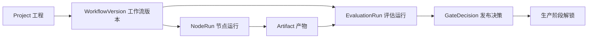
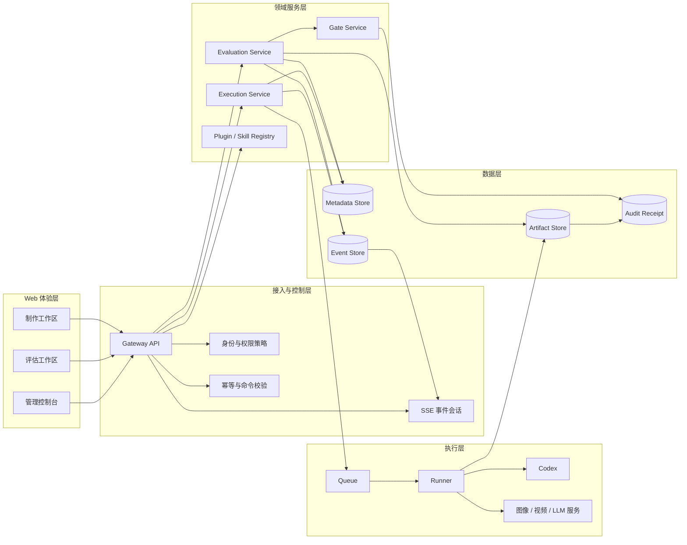
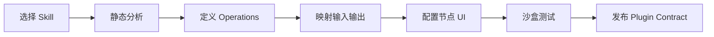
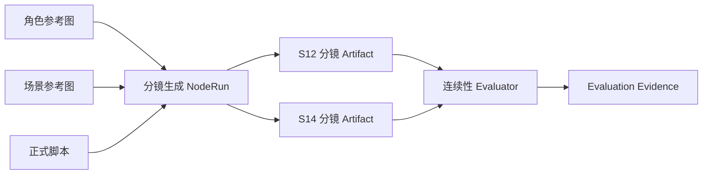
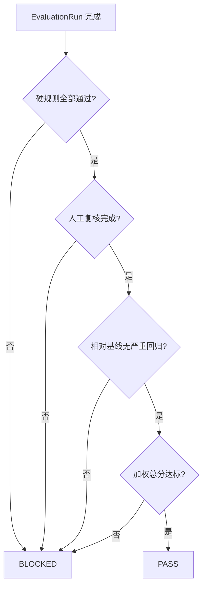
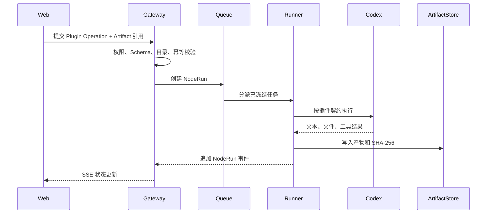

# 柠萌旅行记 Agent 工作台最新技术架构

> 版本：V1.2  
> 状态：可执行技术基线  
> 更新日期：2026-08-11  
> 范围：Web 节点工作台、管理控制台、评估工作区、Evaluation API、Artifact Store、Evaluator、发布 Gate 与 Codex Runner 规划

## 1. 文档目的

本文档定义柠萌旅行记 Agent 工作台的最新技术架构，用于指导后续前端、后端、Codex Runner、Skill 转插件、资产管理和质量评估的统一实施。

架构需要解决以下核心问题：

1. 脚本或分镜生成过程中容易漏内容，尤其是镜号缺失。
2. 图片资产数量多，输入、输出和参考关系需要直接可视化。
3. 每个节点使用哪个 Skill、Plugin 和素材，必须能够追溯。
4. AI 当前执行到哪个阶段、为何阻塞、下一步是什么，需要一目了然。
5. Skill 不能仅依赖自然语言说明直接执行，需要转换为稳定的插件契约。
6. Web 不应直接持有 Codex 或本地文件系统执行权限。
7. 生产结果需要经过确定性规则、AI Judge 和人工复核后才能发布。

## 2. 核心架构结论

采用以下分层结构：

```text
Web 控制面
  → Gateway API
    → Evaluation Service / Execution Service
      → Metadata Store / Artifact Store
        → Audit Receipt / GateDecision
```

关键原则：

- Web 只负责编排、预览、发起命令和订阅状态。
- Gateway 负责鉴权、幂等、策略校验和目录白名单。
- Runner 才能调用 Codex、Skill、Plugin 或外部模型。
- 所有输入在执行前生成不可变快照。
- 所有输出必须登记为 Artifact，并保存 Hash 和来源链。
- 发布权限由 GateDecision 控制，不能由前端手工修改状态绕过。

## 3. 产品信息架构

系统包含三个彼此独立、数据统一的工作区。

| 工作区 | 核心任务 | 核心对象 |
| --- | --- | --- |
| 制作工作区 | 组织素材、脚本、Skill/Plugin 与生成节点，处理当前阻塞 | WorkflowVersion、NodeRun、Artifact |
| 评估工作区 | 管理测试集、版本对比、Evaluator、失败样本和发布 Gate | EvaluationSuite、EvaluationRun、GateDecision |
| 管理控制台 | 管理工程、插件、Skill、Runner、权限、策略和审计 | Registry、Policy、Receipt |

三个工作区共享同一条数据主链：



## 4. 总体逻辑架构



## 5. 各层职责

### 5.1 Web 体验层

技术基线：React、Vite、React Flow。

职责：

- 节点创建、连接、移动、缩放和无限画布操作。
- 多图片资产缩略图和集合预览。
- 脚本正文、结构化镜头和前后镜连续性查看。
- 节点输入、输出、实际 Skill 路由和 Plugin 版本查看。
- NodeRun 和 EvaluationRun 状态展示。
- 失败样本的期望结果、实际结果和 Evaluator 证据对照。
- 管理插件 Schema、Skill 转插件、Runner 和权限策略。

Web 不负责：

- 直接读取或写入任意本地目录。
- 直接调用 Codex CLI。
- 直接执行 Skill 中的命令。
- 自行判定发布状态。

### 5.2 Gateway API

职责：

- 用户身份与项目权限校验。
- 工程目录白名单校验。
- Plugin Operation 权限校验。
- `Idempotency-Key` 去重。
- 请求参数和 JSON Schema 校验。
- 创建 NodeRun、EvaluationRun 等不可变运行收据。
- 提供 SSE 事件订阅和断线恢复。

### 5.3 Evaluation Service

职责：

- 管理 EvaluationSuite 和测试数据集版本。
- 运行确定性 Evaluator、视觉 Judge 和模型 Judge。
- 管理人工复核队列。
- 聚合质量、完整性、延迟和成本指标。
- 对比 Baseline 与 Candidate。
- 根据 GatePolicy 生成 GateDecision。

### 5.4 Execution Service

职责：

- 创建 NodeRun。
- 冻结输入 Artifact、配置和 Plugin 版本。
- 将运行任务提交到 Queue。
- 管理取消、超时、重试、优先级和并发。
- 接收 Runner 事件并登记 Artifact。

### 5.5 Runner

Runner 是唯一允许连接 Codex 和执行插件的组件。

职责：

- 在隔离目录中执行任务。
- 加载已发布的 Plugin Contract。
- 按 Operation 调用 Codex、Skill 适配器或外部模型。
- 限制可读写目录、工具和资源用量。
- 输出 NodeRun 事件、日志和产物。
- 生成可审计执行收据。

Runner 不接受浏览器提交的任意 Shell 命令。

## 6. 核心领域模型

### 6.1 Project

表示一个柠萌旅行记脚本工程。

```ts
interface Project {
  id: string
  name: string
  root: string
  templateVersion: string
  currentWorkflowVersion: string
  stage: ProductionStage
}
```

### 6.2 WorkflowVersion

表示一张已保存的节点图版本。

```ts
interface WorkflowVersion {
  projectId: string
  version: string
  nodeDefinitions: NodeDefinition[]
  edges: WorkflowEdge[]
  createdAt: string
  publishedAt?: string
}
```

已发布版本不可直接覆盖，编辑必须产生新版本。

### 6.3 NodeRun

表示单个节点的一次真实执行。

```ts
interface NodeRun {
  id: string
  projectId: string
  workflowVersion: string
  nodeDefinitionVersion: string
  pluginVersion: string
  operation: string
  inputSnapshot: Record<string, unknown>
  inputArtifactIds: string[]
  skillRoute?: string
  status: 'QUEUED' | 'RUNNING' | 'COMPLETED' | 'FAILED' | 'CANCELLED'
  createdAt: string
  completedAt?: string
}
```

### 6.4 Artifact

Artifact 是图片、脚本、视频和结构化结果的统一载体。

```ts
interface Artifact {
  id: string
  projectId: string
  role: ArtifactRole
  shotId?: string
  filename: string
  mediaType: string
  byteSize: number
  sha256: string
  uri: string
  producerRunId?: string
  sourceArtifactIds: string[]
  createdAt: string
}
```

当前定义的 Artifact Role 包括：

- `script.final`
- `storyboard.draft`
- `storyboard.final`
- `image.reference`
- `evaluation.evidence`

约束：

- 生成类 Artifact 必须填写 `producerRunId`。
- 所有 Artifact 必须保存 SHA-256。
- 输入来源必须通过 `sourceArtifactIds` 显式声明。
- 分镜类 Artifact 必须填写 `shotId`。
- `uri` 必须是受控读取地址，不能直接暴露任意本地路径。

### 6.5 EvaluationSuite

```ts
interface EvaluationSuite {
  id: string
  projectId: string
  dataset: DatasetVersion
  baselineVersion: string
  candidateVersion: string
  evaluators: EvaluatorVersion[]
  gatePolicy: GatePolicyVersion
}
```

EvaluationSuite 必须冻结以下版本：

- 测试数据集版本。
- Baseline 工作流版本。
- Candidate 工作流版本。
- 每个 Evaluator 的版本。
- GatePolicy 版本。

### 6.6 EvaluationRun

```ts
interface EvaluationRun {
  id: string
  suiteId: string
  projectId: string
  datasetVersion: string
  baselineVersion: string
  candidateVersion: string
  evaluatorVersions: EvaluatorVersion[]
  status: 'QUEUED' | 'RUNNING' | 'COMPLETED' | 'FAILED'
  results?: EvaluationResult
}
```

### 6.7 GateDecision

```ts
interface GateDecision {
  runId: string
  policyVersion: string
  verdict: 'PASS' | 'BLOCKED'
  failedRules: string[]
  pendingReviews: number
  evidenceArtifactIds: string[]
}
```

GateDecision 只能引用已经完成的 EvaluationRun。

## 7. 节点与 Plugin Contract

### 7.1 节点定义

节点不是自由表单，而是一个版本化的插件操作实例。

```ts
interface NodeDefinition {
  id: string
  pluginId: string
  pluginVersion: string
  operation: string
  inputSchema: JsonSchema
  outputSchema: JsonSchema
  uiSchema: NodeUiSchema
  requiredValidators: string[]
  permissionPolicyId: string
}
```

### 7.2 Skill 转插件

Skill 需要经过以下转换流程：



转换规则：

- 只读取 `SKILL.md` 和直接引用资源进行分析。
- 明确区分 Skill 原始声明与 AI 推断。
- AI 推断的输入、输出、Artifact Role 和 Validator 必须人工确认。
- 未确认的推断不能进入插件契约。
- 插件必须显式声明可读写目录、可调用工具和最大资源用量。

## 8. Artifact Store

### 8.1 存储结构

Artifact 文件与元数据分离：

```text
Metadata Store
  └── Artifact metadata
        ├── id
        ├── role
        ├── sha256
        ├── producerRunId
        ├── sourceArtifactIds
        └── uri

Artifact Store
  └── artifact-files/
        └── artifact_<id>-<filename>
```

当前本地 API 使用：

- `.data/agent-workbench.sqlite` 保存 Artifact 与其他业务实体元数据。
- `.data/artifact-files/` 保存文件内容。
- SQLite WAL 与事务保证整批实体写入的一致性。
- 首次启动可从旧 `.data/*.json` 元数据一次性迁移，后续只写 SQLite。

生产环境建议：

- Postgres 保存 Artifact 元数据。
- S3、R2 或 MinIO 保存文件内容。
- 数据库只保存 URI、Hash 和关系，不保存大文件正文。

### 8.2 来源图谱



## 9. Evaluator 架构

### 9.1 Evaluator 类型

| 类型 | 用途 | 当前状态 |
| --- | --- | --- |
| Deterministic | 镜号覆盖、Schema、命名、来源完整性 | 镜号覆盖和来源完整性已实现 |
| Vision Judge | 角色外观、场景、构图、视觉连续性 | 待接模型 |
| Model Judge | 脚本一致性、台词节奏、叙事逻辑 | 待接模型 |
| Human Review | 低置信度、风格取舍、高影响发布 | 任务、领取、证据、结论、Gate 修订与审计已实现 |

### 9.2 镜号覆盖 Evaluator

输入：

- 指定工程的分镜 Artifact 集合。
- 预期镜号，例如 S01–S19。

输出：

```json
{
  "evaluatorId": "shot-coverage",
  "version": "1.1.0",
  "score": 95,
  "threshold": 100,
  "verdict": "FAIL",
  "missingShotIds": ["S13"],
  "actualCount": 18,
  "expectedCount": 19
}
```

### 9.3 来源完整性 Evaluator

校验生成类 Artifact 是否具有：

- `producerRunId`
- `sha256`
- `sourceArtifactIds`

任意必需字段缺失时返回 `FAIL`。

### 9.4 Judge 统一输出契约

后续 Vision Judge 和 Model Judge 统一返回：

```ts
interface EvaluatorResult {
  evaluatorId: string
  evaluatorVersion: string
  caseId: string
  score: number
  threshold: number
  verdict: 'PASS' | 'FAIL' | 'NEEDS_REVIEW'
  evidenceArtifactIds: string[]
  explanation: string
  modelVersion?: string
  promptVersion?: string
}
```

## 10. 发布 Gate

Gate 不等同于平均分。

判定顺序：

1. 检查必需 Artifact 是否存在。
2. 检查镜号覆盖、Schema 和来源链等硬规则。
3. 检查是否仍有未完成人工复核。
4. 检查 Candidate 相对 Baseline 是否发生超阈值回归。
5. 以上全部通过后再检查加权质量总分。



当前已验证场景：

- Artifact Store 中存在 S12 和 S14。
- S13 不存在。
- 镜号覆盖 Evaluator 返回 `missingShotIds: ["S13"]`。
- 发布结论为 `BLOCKED`。

## 11. API 契约

### 11.1 当前已实现 API

| 方法 | 路径 | 用途 |
| --- | --- | --- |
| GET | `/api/health` | 服务健康检查 |
| POST | `/api/artifacts` | 上传 Artifact 并计算 SHA-256 |
| GET | `/api/artifacts` | 按工程、角色、镜号查询 Artifact |
| GET | `/api/artifacts/:artifactId` | 获取 Artifact 元数据 |
| GET | `/api/artifacts/:artifactId/content` | 读取受控文件内容 |
| PATCH | `/api/artifacts/:artifactId/activate` | 将指定版本持久化设为当前版本 |
| GET | `/api/evaluation-suites/:suiteId` | 获取评估套件 |
| POST | `/api/evaluation-runs` | 创建 EvaluationRun |
| GET | `/api/evaluation-runs/:runId` | 查询运行状态 |
| GET | `/api/evaluation-runs` | 按工程和状态查询运行，用于刷新恢复 |
| GET | `/api/evaluation-runs/:runId/events` | 订阅或续传 SSE |
| POST | `/api/evaluation-datasets/:id/regression-cases` | 加入历史失败回归集 |
| POST | `/api/evaluator-runs` | 执行确定性 Evaluator |
| POST | `/api/gate-decisions` | 生成 GateDecision |
| GET | `/api/gate-decisions` | 查询工程 GateDecision 并回写制作阶段 |

### 11.2 幂等要求

所有创建运行的 API 必须接受：

```http
Idempotency-Key: <client-generated-id>
```

相同幂等键重复提交时返回同一运行收据，不创建重复任务。

## 12. 事件模型与 SSE

事件采用追加式结构：

```json
{
  "eventId": "evt_eval_xxx_12",
  "runId": "eval_xxx",
  "sequence": 12,
  "type": "EVALUATOR_COMPLETED",
  "occurredAt": "2026-08-11T10:25:31.000Z",
  "payload": {
    "caseId": "CASE-013",
    "evaluatorId": "composition-continuity",
    "score": 0.63,
    "threshold": 0.8,
    "verdict": "FAIL"
  }
}
```

客户端要求：

- 按 `sequence` 排序。
- 按 `eventId` 去重。
- 保存最后确认的事件 ID。
- 断线后通过 `Last-Event-ID` 恢复。
- 页面刷新后根据 Run ID 恢复，不重新创建任务。

当前后端已经支持：

- SSE 事件输出。
- 历史事件回放。
- `Last-Event-ID` 续传。
- Evaluation 事件通过 SQLite Repository 持久化。
- HTTP Adapter 已使用 EventSource，并支持页面刷新恢复、心跳续租和跨标签页防重复执行。

## 13. Codex Runner 连接方式

推荐链路：



Runner 必须具备：

- 项目根目录白名单。
- 单次任务隔离工作目录。
- 工具调用白名单。
- 运行超时、资源上限和取消。
- 输入快照和输出 Hash。
- Plugin 版本与 Skill 路由记录。
- 不可变 NodeRun Receipt。

## 14. 安全与权限

| 控制点 | 必须实现 | 禁止事项 |
| --- | --- | --- |
| 工程目录 | Gateway 校验项目白名单 | 浏览器提交任意绝对路径 |
| Plugin | 只执行已发布版本 | 节点携带任意 Shell 命令 |
| Skill | 转换为显式输入输出和权限 | 仅靠自然语言说明直接执行 |
| Runner | 隔离、超时、资源上限和审计 | 共享无限制主机权限 |
| Artifact | Hash、来源链和受控 URI | 暴露文件系统真实路径 |
| Gate | 引用策略版本和证据 | 手工修改状态绕过发布门 |

## 15. 本地部署与运行

### 15.1 仅运行前端原型

```bash
npm run dev
```

使用 Mock API，适合验证 UI 和节点交互。

### 15.2 运行完整本地链路

```bash
npm run dev:full
```

同时启动：

- Vite Web。
- `127.0.0.1:8788` Evaluation API。
- Vite `/api` 反向代理。
- Artifact 文件与 SQLite 元数据持久化。

### 15.3 单独运行 API

```bash
npm run dev:api
```

### 15.4 生产部署建议

```text
Web 静态站点
  + Gateway API
  + Postgres
  + S3 / R2 / MinIO
  + Redis / 消息队列
  + 隔离 Runner 集群
```

## 16. 当前实现状态

### 16.1 已完成

- 制作工作区、评估工作区、管理控制台三入口。
- React Flow 无限节点画布。
- 多图片资产节点和预览交互。
- 脚本、图片、连续性和问题检查器。
- Plugin 输入输出 Schema 编辑。
- Skill 分析与 AI 推断确认门禁。
- EvaluationSuite、EvaluationRun 和 GateDecision 领域模型。
- Evaluation HTTP API。
- EvaluationRun 幂等创建和持久化。
- SSE 历史回放和 `Last-Event-ID` 续传。
- Artifact 文件与元数据存储。
- SHA-256 和 Artifact 来源链。
- 制作工作区多资产上传接入 Artifact API。
- 上传队列支持多文件、图片预览、Artifact Role 和重复处理策略。
- 工程资产列表展示镜号、SHA-256、生产 Run 与文件大小。
- 画布 R0 资产集合和分镜集合按 Artifact Store 数据实时刷新。
- 工程资产支持文件名、镜号、Hash 和 Artifact Role 筛选。
- 检查器支持正式脚本内容、相邻镜、真实版本时间线和来源血缘。
- 资产替换上传自动继承 `versionGroupId` 并登记来源 Artifact。
- 版本检查器支持持久化“设为当前”和可交互上下游来源关系图。
- 上游版本变化会递归将依赖产物标记为 `STALE`，画布突出显示失效镜头。
- 评估工作区已使用 EventSource 接收开始、完成和失败事件。
- 页面刷新后可通过本地 Run ID 或服务端 RUNNING 列表恢复运行和 SSE。
- 镜号覆盖与来源完整性已经写入 EvaluationRun 指标聚合。
- EvaluationRun 完成后自动持久化 GateDecision，并回写制作阶段。
- SSE 提供周期性 `HEARTBEAT`，用于连接健康判断和执行锁续租。
- 前端通过标签页身份与带过期时间的租约锁避免重复创建 EvaluationRun。
- SQLite Repository 已持久化 EvaluationRun、Event、Artifact、GateDecision 和回归样本。
- SQLite 开启 WAL，并通过事务替换同类实体快照；包含 Schema Migration 版本表。
- 旧 JSON 元数据支持一次性迁移，服务重启恢复测试已覆盖。
- Repository Factory 已支持 SQLite/PostgreSQL 环境切换，HTTP API 不感知具体驱动。
- PostgreSQL Adapter 使用 JSONB 和版本化迁移 SQL，并通过共享 Repository 契约测试。
- 服务端租约支持原子获取、Token 续租、条件释放和过期接管，同工程同评估套件只允许一个执行所有者。
- Evaluation Event 已迁移为追加式事件表，使用 `(run_id, sequence)` 保证有序回放。
- Run、Artifact、GateDecision 和回归样本采用细粒度 upsert，避免整类快照覆盖新增数据。
- `/api/health` 暴露实例 ID、Repository 驱动、Event Store 模式和租约 TTL。
- PostgreSQL 通过 `LISTEN/NOTIFY` 跨实例通知，并以 sequence 轮询补偿通知丢失窗口。
- SQLite 通过游标轮询支持本地多 API 实例订阅；API-A 执行、API-B SSE 接收已纳入测试。
- EvaluationRun 完成后会从失败样本自动建立 Human Review 任务。
- Reviewer 领取任务时取得 15 分钟持久化租约与一次性 Claim Token，其他复核人不能并发提交。
- 复核结论支持 `PASS / FAIL / NEEDS_CHANGES`，必须填写意见并校验关联 Artifact 证据。
- 每次提交生成新的 GateDecision，通过 `supersedesDecisionId` 追溯历史决策。
- ReviewTask 创建、领取、提交均写入 AuditEvent；管理端审计查询要求 Admin 角色。
- 镜号覆盖 Evaluator。
- Artifact 来源完整性 Evaluator。
- 失败样本加入回归集。
- 18 项自动化测试全部通过。
- Vite 正式构建通过。

### 16.2 部分完成

- 无 Artifact 的演示工程仍保留显式标注的示例降级数据；正式工程应关闭该降级策略。
- EvaluationRun 主流程仍包含部分示例质量指标；镜号覆盖和来源完整性已接入真实聚合。
- EventSource 已支持刷新恢复、心跳与多标签页执行锁；正式分布式锁仍需后端实现。
- Human Review 已完成任务、证据、领取、提交和 Gate 回写；当前身份仍为请求头模拟。

### 16.3 尚未实现

- 跨工程 Artifact 依赖图和版本影响自动重跑。
- Vision Judge。
- Model Judge。
- 正式身份认证、工程级授权和角色管理。
- Queue 和 Codex Runner。
- Plugin Contract 后端注册与发布。
- 生产级用户身份和工程权限。

## 17. 已知技术债

1. 服务端租约和细粒度写入已完成，但内存 Map 仍作为读缓存；跨实例读取依赖按请求刷新策略继续收敛。
2. Event 已支持 PostgreSQL `LISTEN/NOTIFY` 与轮询补偿；更高吞吐量阶段可迁移 Redis Streams 或专用消息总线。
3. 前端 bundle 超过 500 KB，需要按工作区进行动态加载。
4. Artifact 内容接口尚未增加 Range、缓存和签名 URL。
5. 浏览器存储锁仍用于前端即时反馈，真正执行所有权已由服务端持久化租约兜底；后续应统一前后端锁状态展示。
6. Evaluator 结果需要与 EvaluationRun 聚合彻底统一。
7. 所有发布规则需要版本化管理界面和审批记录。

## 18. 后续实施路线

### P1：真实资产 UI

- 已完成：多资产上传接入 Artifact API。
- 已完成：展示 SHA-256、Artifact Role、镜号、生产 Run 和文件大小。
- 已完成：画布节点缩略图、镜号覆盖和脚本检查器接入 Artifact API。
- 已完成：图片集合预览、搜索、Role 筛选、版本时间线和直接来源展示。
- 已完成：资产替换、版本组、持久化当前版本切换和可交互来源关系图。
- 待完成：版本切换后的下游失效标记与自动重跑编排。

验收标准：制作工作区中的图片和脚本数据全部来自 Artifact API。

### P2：实时评估闭环

- 已完成：前端使用 EventSource 接收评估运行事件。
- 已完成：SSE 事件在评估工作区形成实时事件面板。
- 已完成：资产版本变化递归标记下游 Artifact 失效。
- 已完成：确定性 Evaluator 真实结果接入 EvaluationRun 指标聚合。
- 已完成：GateDecision 持久化并回写制作阶段。
- 已完成：页面刷新后恢复正在执行或刚完成的 Run。
- 已完成：SSE 心跳和浏览器多标签页执行锁。
- 已完成：健康接口暴露实例、存储驱动、Event Store 模式与租约 TTL。
- 已完成：服务端持久化租约锁与双 API 实例防重验证。
- 已完成：跨实例 Event Pub/Sub；API-A 执行、API-B SSE 接收验证通过。
- 待完成：统一前后端锁状态展示。

验收标准：断线、刷新不会导致任务重复执行或状态丢失。

### P3：数据库化

- 已完成：提取统一 SQLite Repository 边界。
- 已完成：使用 SQLite 作为本地开发数据库，并启用 WAL。
- 已完成：增加 Schema Migration 版本表。
- 已完成：从旧 JSON 元数据一次性迁移。
- 已完成：服务重启恢复 Run、Event、Artifact、GateDecision 和回归样本。
- 已完成：PostgreSQL Adapter、JSONB 表结构和独立迁移 SQL。
- 已完成：SQLite/PostgreSQL 共享 Repository 契约测试。
- 已完成：细粒度实体写入、服务端持久化租约与追加式 Event Store。
- 已完成：双 API 实例共享 SQLite 时的评估防重测试。
- 已完成：跨实例 Event Pub/Sub 与按 Run 读取刷新。
- 待完成：列表级读缓存刷新与更高吞吐消息总线。

验收标准：服务重启后 Project、Run、Event、Artifact 和 GateDecision 均可恢复。

### P4：Codex Runner

- Queue、Runner 注册和心跳。
- Plugin Contract 解析。
- Codex 执行适配器。
- 目录与工具权限。
- 取消、超时、重试和审计。

验收标准：浏览器不能越权执行任意命令，每次执行均生成完整 NodeRun Receipt。

### P5：智能 Judge 与人工复核

- Vision Judge。
- Model Judge。
- 模型、提示词和参数版本记录。
- 已完成：人工复核任务自动创建和持久化。
- 已完成：领取租约、角色权限、Claim Token 和审计。
- 已完成：证据关联、结论提交与版本化 GateDecision 回写。
- 待完成：接入正式身份和工程级授权服务。
- 失败样本自动进入候选回归集。

验收标准：每个评分都能追溯到输入、模型、提示词、版本和证据 Artifact。

### P6：生产发布治理

- GatePolicy 管理。
- 审批流。
- 审计查询。
- 监控、告警和成本统计。
- Runner 集群与正式对象存储。

验收标准：所有生产阶段解锁均由版本化 GateDecision 驱动。

## 19. 当前验收基线

- 代码自动测试：22/22 通过。
- 正式前端构建：通过。
- API 测试覆盖：幂等、持久化、SSE、断线续传、Artifact Hash、来源链和 Gate。
- 真实规则测试：S12、S14 存在但 S13 缺失时，返回 `BLOCKED`。
- 当前原型目录：`agent-development/prototype-v4`。

## 20. 下一交付建议

下一步优先完成：

```text
Queue / Codex Runner
  → 正式身份与工程授权
    → Vision / Model Judge
```

先把资产真实性、状态恢复和评估可信度做实，再扩大 Codex 执行权限，可以显著降低返工和安全风险。
