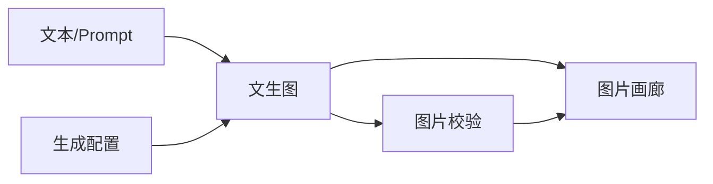
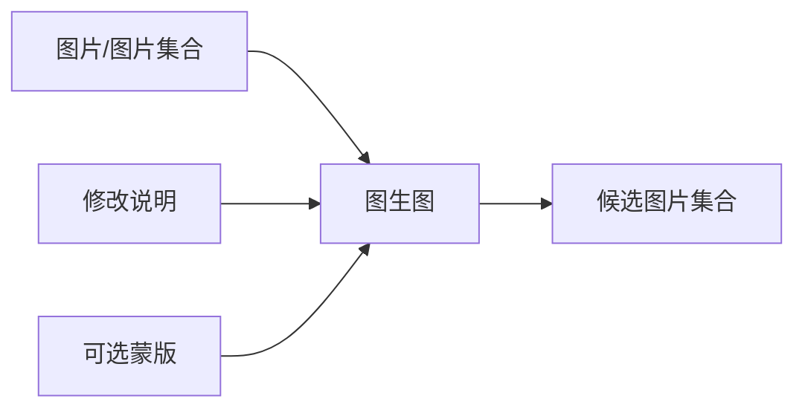
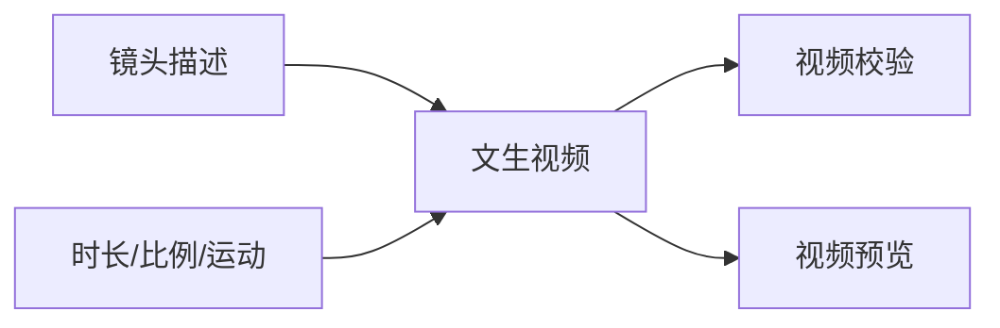
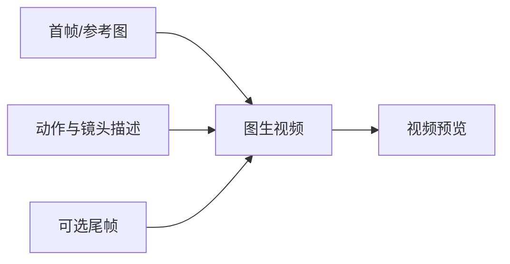
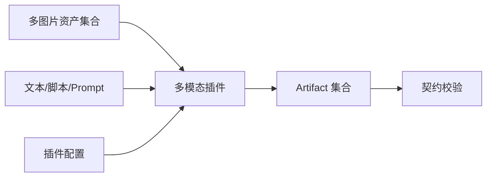

# 多模态无限节点画布 Harness V0.8

## 1. Harness 定位

本 Harness 是无限节点画布的“产品交互 + 工作流契约 + 验收夹具”，不是单一生成 Skill，也不是固定的图片生成链路。

它解决四个问题：

1. 用户能否在无限画布中自由组合图片、文本、视频和插件节点；
2. 每条连线是否传递兼容、可追溯的数据；
3. 运行前是否能明确执行范围、输入快照、成本与风险；
4. 生成结果是否能以 Artifact 形式预览、比较、复用和审计。

Harness 分为三层：

| 层 | 职责 | 当前是否执行真实模型 |
|---|---|---|
| Canvas Interaction | 节点 CRUD、拖放、连接、配置、多资产预览、撤销重做 | 否 |
| Contract Validation | 节点定义、Typed Port、图拓扑、配置与输入预检 | 是，本地确定性验证 |
| Execution Adapter | 模型、插件、Skill、Codex、队列与 Artifact 收集 | 否，后续接入 |

### 1.1 统一图校验内核

`prototype/graph-core.js` 是当前唯一图规则实现，同时供画布检查、WorkflowVersion 发布、V0.7/V0.8 JSON 导入、模拟 WorkflowRun 预检和 `bin/validate.mjs` 调用。

校验器返回结构化 `GraphIssue`：

```json
{
  "code": "GRAPH_CYCLE_DETECTED",
  "severity": "error",
  "message": "检测到未声明环路：a → b → a",
  "nodeId": "a",
  "path": "edges"
}
```

稳定错误码覆盖：重复节点/连线 ID、未知 NodeDefinition、非法位置、悬空连线、未知端口、端口类型不兼容、单值输入重复连接、必填输入缺失、未声明环路、NodeDefinition 版本缺失、插件 Executor 缺失、插件依赖锁缺失或不匹配。

### 1.2 无限坐标与性能基线

画布世界不再声明固定宽高。节点坐标允许为负数或远距离数值；视口通过 `pan + scale` 映射世界坐标，网格随视口同步移动和缩放。

拖动热路径必须满足：

- 不调用 `renderNodes()` 或 `renderEdges()`；
- 只修改移动节点的 `left/top`；
- 只重新计算与移动节点相连的 SVG Path；
- 分组只更新受影响的包围框；
- 缩略图更新合并到 `requestAnimationFrame`；
- 端口坐标优先从真实 DOM 中心换算为世界坐标。

基线命令：

```bash
npm run benchmark
```

浏览器真实 DOM 夹具：`/?benchmarkNodes=300`。基准模式不会覆盖当前工程草稿，并在 `body.dataset` 暴露首次渲染、完整重绘次数和最后一次拖动增量耗时。

2026-08-12 本机参考结果：300 节点、150 连线首次完整渲染约 80ms；选中后拖动不增加完整节点/连线重绘次数，单次增量更新约 0.20ms。1000 节点、500 连线的共享图校验约 2.5ms。

## 2. 非目标

V0.8 不负责：

- 选择具体图片/视频模型供应商；
- 保存真实 API Key；
- 直接执行 Shell 或任意代码；
- 实现计费、并发队列或跨组织权限；
- 将工作流固化为柠萌旅行记单一流程。

这些能力必须在交互和契约验证通过后，通过受治理的 Plugin/Runner 扩展。

## 3. 画布模式

### 3.1 设计模式

允许：

- 从节点库、右键菜单、`/` 命令或端口推荐创建节点；
- 拖动、复制、删除、禁用、分组、框选和自动布局；
- 连接或删除端口，编辑字段映射；
- 配置模型/插件参数与输出契约；
- 添加、排序、标注、绑定与预览多资产；
- 撤销/重做、自动保存和发布草稿。

禁止：在未发布草稿上产生正式运行收据。

### 3.2 运行模式

进入运行模式时冻结 WorkflowVersion。拓扑只读，允许：

- 运行节点、选中分支、从此运行、运行到此或运行全图；
- 查看预检、预算、Runner、缓存、审批和预计输出；
- 取消、重试、查看事件、输入快照和收据。

### 3.3 审阅模式

以产物与证据为中心：

- 查看图片网格、视频播放器、脚本全文和结构化 JSON；
- 在图片、提示词、生成参数、上游素材和版本之间切换；
- 比较候选结果，设置当前版本，标记通过/需修改；
- 从问题创建修复草稿或局部重跑。

## 4. 核心数据类型

端口使用语义类型，不直接使用界面控件类型。

| 类型 | 说明 | 常见来源 |
|---|---|---|
| `text.plain` | 普通文本 | 文本输入、上游输出 |
| `text.prompt` | 生成提示词 | Prompt 节点、模板节点 |
| `document.script` | 脚本或分镜文本 | 脚本资产、Skill 输出 |
| `image.single` | 单张图片 | 图片输入、图像生成结果 |
| `image.collection` | 多图片资产集合 | 资产集合、批量生成结果 |
| `video.single` | 单个视频 | 视频生成结果、上传资产 |
| `video.collection` | 视频集合 | 批量视频生成结果 |
| `mask.single` | 单张蒙版 | 蒙版绘制、分割插件 |
| `config.json` | 结构化参数 | 配置或映射节点 |
| `artifact.any` | 明确声明可接受的任意 Artifact | 预览、归档等通用节点 |
| `artifact.collection` | 异构产物集合 | 插件编排、交付包 |
| `report.validation` | 校验报告 | Validator |

### 4.1 兼容规则

- 相同类型可直接连接。
- `image.single` 可以被显式包装为 `image.collection`，但不能静默转换。
- `image.collection` 不能直接连接 `image.single`；必须选择一项或使用批处理节点。
- `text.plain` 不能静默替代 `text.prompt`；允许使用 Prompt Composer 转换。
- 任意输出可进入显式声明的 `artifact.any`。
- `artifact.any` 不能反向连接具体媒体端口。
- 视频与图片之间必须经过抽帧、合成或生成节点。
- 不兼容连接应被拒绝，并推荐转换节点。

## 5. 节点分层

### 5.1 输入与资产节点

- Text Input
- Prompt Composer
- Script Asset
- Image Asset
- Image Collection
- Video Asset
- Mask Asset

### 5.2 生成节点

- Text to Image
- Image to Image
- Text to Video
- Image to Video
- Multimodal Plugin Run

### 5.3 处理节点

- Select Asset
- Merge Collection
- Batch Map
- Frame Extract
- Field Mapper

### 5.4 质量与人工节点

- Image Validator
- Video Validator
- Human Review
- Gate

### 5.5 结果节点

- Image Gallery
- Video Gallery
- Artifact Collection
- Export Package

## 6. 节点界面分层

### 6.1 画布卡片

仅显示：

- 节点名称、类别、来源版本和状态；
- 必需输入完成度，如 `参考图 3/5`；
- 最多 4 个缩略图及 `+N`；
- 核心参数摘要，如模型、比例、时长；
- 主操作，如“完成配置”“预检并运行”“查看结果”。

### 6.2 Inspector

标签固定为：

- 配置；
- 输入；
- 输出；
- 运行；
- 问题；
- 历史与血缘。

### 6.3 全屏资产查看器

- 图片：大图、缩放、版本比较、提示词、上游素材、EXIF/元数据；
- 视频：播放、逐帧、时间轴、首尾帧、生成参数和音轨信息；
- 集合：网格/列表、筛选、多选、排序、镜号/角色标签和批量动作。

## 7. 五类基础模板

## 7.1 文生图



必填：Prompt。  
可选：负向提示、风格、宽高比、种子。  
输出：单图或图片集合。  
预检：模型能力、尺寸、数量、敏感内容策略和预算。

## 7.2 图生图



必填：至少一张图片、修改说明。  
可选：蒙版、参考强度、保留区域。  
输出：候选图集合，并保留来源图片血缘。  
交互重点：多图角色、顺序、主参考图和局部编辑范围。

## 7.3 文生视频



必填：镜头描述。  
可选：镜头运动、时长、比例、音频策略。  
输出：视频及封面、元数据。  
预检：时长上限、分辨率、预算和审核策略。

## 7.4 图生视频



必填：首帧或参考图、动作描述。  
可选：尾帧、人物一致性参考、运镜、时长。  
输出：视频并回链首帧、尾帧和提示词。  
交互重点：首/尾帧角色不能由连线顺序猜测，必须在端口或资产角色中明确。

## 7.5 图 + 文 + 插件



该模板是扩展核心，不预设输出一定为图片或视频。

插件必须声明：

- `pluginId`、版本和 operation；
- 输入/输出端口及 JSON Schema；
- 每个图片端口允许的角色、数量和顺序；
- 是否允许部分成功；
- 需要的权限、Runner 能力、模型和外部工具；
- 输出 Artifact Role、命名规则和 Validator；
- 超时、重试、取消与幂等策略。

Skill 需要先经过 Skill → Plugin Adapter 流程，不能把任意 SKILL.md 直接作为画布可执行节点。

## 8. 多资产交互规则

### 8.1 添加

- 支持本机、工程资产、上游产物、粘贴和历史工程引用。
- 添加后先进入待确认队列，不立即写入端口。
- 自动解析格式、Hash、尺寸、时长、来源和建议角色。
- 重复、损坏、缺少权限和不支持格式必须单独显示。

### 8.2 绑定

- 用户选择目标端口和资产角色，如 `character_reference`、`first_frame`、`end_frame`。
- 支持必选/可选、主参考图、顺序和版本固定。
- 节点显示数量与上限，如 `3/8`。
- 解除绑定不等于删除源资产。

### 8.3 预览

- 节点内最多显示 4 项；Inspector 显示横向胶片；全屏显示虚拟化网格。
- 视频显示封面、时长和状态，不自动播放全部预览。
- 选择资产后可查看它被哪些节点和运行引用。

## 9. 右键与快捷创建

### 空白画布

- 添加节点；
- 粘贴；
- 添加 Frame/注释；
- 载入组合模板；
- 适配全图；
- 锁定画布。

### 节点

- 配置；
- 运行节点；
- 从此运行；
- 运行到此；
- 查看输入输出；
- 复制/禁用/创建模板/删除。

### 连线

- 查看类型与数据映射；
- 插入兼容节点；
- 禁用；
- 删除。

### 端口拖到空白

打开推荐菜单，只显示输入类型兼容的节点；选择后自动创建和连接。

## 10. 预检规则

运行前必须检查：

1. 工作流版本已冻结；
2. 图无非法环路；
3. 所有必填端口已连接或有常量值；
4. 所有边类型兼容；
5. 资产存在、可读、版本明确且未被归档；
6. Plugin/NodeDefinition 版本已发布；
7. Runner 具备媒体、模型和插件能力；
8. 输出路径与命名规则合法；
9. 预算、超时和重试策略已确定；
10. 高风险权限已审批或准备进入等待审批状态。

预检失败不创建正式 NodeRun。预检只给出“原因 + 定位 + 修复动作”，不能只显示红色状态。

## 11. 执行状态

```text
DRAFT
  → PREFLIGHTING
  → READY
  → QUEUED
  → DISPATCHED
  → RUNNING
  → WAITING_APPROVAL
  → COLLECTING
  → VALIDATING
  → SUCCEEDED | PARTIAL | FAILED | CANCELLED | TIMED_OUT | LOST
```

`SUCCEEDED` 只表示执行器完成；节点是否 `PASS` 仍由输出契约、Validator 与 Gate 决定。

## 12. 运行收据

每次真实运行必须记录：

- projectId、workflowVersionId、nodeInstanceId、nodeDefinitionId/version；
- runScope 和父运行/重试关系；
- 冻结输入 Artifact ID、版本、Hash 与端口角色；
- 实际 executorRef、Plugin operation、Skill route、模型和 Runner；
- 配置快照与允许权限；
- 结构化事件、开始/结束时间、成本和错误；
- 输出 Artifact ID、Hash、角色与 Validator 结果；
- 人工审批、GateDecision 和审计引用。

## 13. 交互验收矩阵

| 场景 | 必须通过的交互 |
|---|---|
| 文生图 | 从空白画布 3 分钟内创建 Prompt → 文生图 → 图片画廊 |
| 图生图 | 一次添加 12 张图，指定主参考并将其中 4 张绑定到输入端口 |
| 文生视频 | 配置时长、比例并从预检识别预算和能力限制 |
| 图生视频 | 明确区分首帧、尾帧与普通参考图，错误绑定可解释 |
| 图 + 文 + 插件 | 从已发布 NodeDefinition 创建节点，输入输出 Schema 可检查 |
| 非法连线 | 拒绝连接并推荐转换节点 |
| 删除恢复 | 删除节点后撤销，边和配置同步恢复 |
| 局部运行 | 运行选择的子图，不重跑无关节点 |
| 失败恢复 | 从失败节点查看输入快照并仅重试失败范围 |
| 资产审阅 | 在图片/视频、提示词、参数、版本和血缘间切换 |

## 14. 与现有 Agent 工作台的接入边界

| Harness 对象 | 工作台对象 |
|---|---|
| Node Definition | NodeDefinition |
| Canvas Node | NodeInstance |
| Canvas Edge | Typed Edge / Port Binding |
| Workflow Template | WorkflowDraft 初始图 |
| Published Graph | WorkflowVersion |
| Asset Reference | Artifact / ArtifactCollection |
| Harness Run | NodeRun / WorkflowRun |
| Validation Result | Problem / ValidationReport |
| Release Decision | GateDecision |

接入顺序：

1. 前端本地加载 catalog 和 examples；
2. 完成节点 CRUD、端口连接和多资产交互；
3. 用本地 validator 完成交互预检；
4. 可用性验收通过后接 WorkflowDraft 持久化；
5. 最后接真实 NodeRun、Plugin Adapter 与 Artifact Store。

## 15. V0.8 完成定义

满足以下条件即视为 Harness V0.8 完成：

- 五个示例工作流全部通过本地验证；
- 每类生成节点都声明类型化端口；
- 非法端口、悬空必填输入、重复节点、无效边和非法环路会被拒绝；
- 画布能基于 catalog 创建节点，而不是写死节点数组；
- 多资产能按角色、数量和顺序绑定；
- 设计、运行、审阅模式的权限和状态明确；
- 输出端口可直接拖到兼容输入端口，拖动中显示兼容反馈；
- 支持框选、多选、整组移动、复制、删除与基础对齐；
- 缩略图投影真实节点与当前视口，并可用于快速导航；
- 世界坐标不受固定画布宽高限制，负坐标与远距离节点可被缩略图和适配全图覆盖；
- 节点拖动不触发全量节点或连线 DOM 重建；
- 300 节点浏览器夹具和 1000 节点计算夹具均满足版本内性能预算；
- Inspector 的配置、输入、输出、运行、问题与历史标签均有实际内容；
- 多选节点可形成可折叠分组，分组可整体移动或取消；
- 节点禁用后，其节点与关联连线不进入运行前必填校验；
- 端口拖到空白只展示类型兼容节点，并在创建后自动连线；
- 已有连线可安全重接来源或目标，且继续执行类型与基数检查；
- 多资产绑定会写入节点配置中的引用及角色映射；
- 快捷键帮助与实际画布命令保持一致；
- 插件管理中心可维护基本信息、语义版本与 Executor Ref；
- 插件输入输出 Schema 可自定义类型、基数和必填约束；
- Skill 文本可分析并转换为插件支持的端口和执行路由；
- 插件测试台可在不调用真实执行器的情况下验证输入契约；
- 发布后的插件立即进入节点库，并能创建普通类型化节点；
- 草稿、已发布快照和测试结果均保存在浏览器本机；
- 运行前可选择完整图、所选节点、运行到此或从此运行；
- 每个 NodeRun 都展示排队、运行、成功、失败、阻塞或跳过状态；
- 可注入确定性故障并从失败节点重试，同时保留冻结输入语义；
- 事件、问题、输入输出快照和最终运行收据均可查看；
- 图片、视频、脚本与其他 Artifact 均有对应的查看方式；
- Web 工作台可创建和切换多个工程，并保持各自草稿；
- Project 是画布草稿的唯一持久化聚合根，当前工程 ID 可在刷新后恢复；
- 新建与切换工程前会保存原工程，并清理撤销、运行与选择等会话状态；
- 工作流可发布为不可变版本，并可恢复为新的可编辑草稿；
- 成功运行自动归档至所属工程，可回看完整收据；
- 发布版本记录当时使用的插件版本与 Executor Ref；
- 工作流可导出为带格式版本的 JSON，并经结构检查后导入；
- 画布、发布、导入、运行预检和 CLI 使用同一 `graph-core` 与稳定错误码；
- 不调用真实模型也能完整演示预检、运行、失败、重试和审阅状态。
