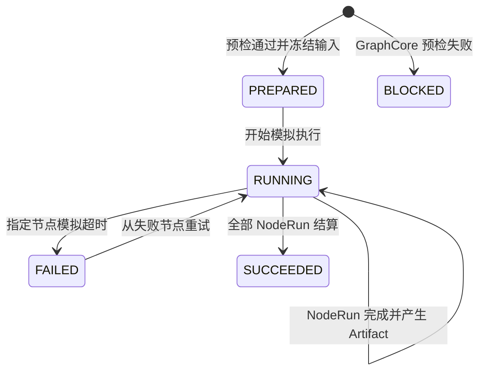

# M3 模拟运行与 Artifact 交互验收

更新日期：2026-08-13  
状态：M3 第一阶段通过；仅为前端模拟执行，不代表真实 Runner 已接入

## 1. 本阶段目标

本阶段验证节点画布是否能清楚回答四个问题：

1. 当前执行到哪个节点？
2. 每个节点实际路由到哪个插件、内置能力或本地内容处理器？
3. 失败后哪些下游被阻塞，用户从哪里重试？
4. 运行产出的图片、文本与收据在哪里查看？

不在本阶段实现真实模型调用、Shell 执行、远程队列、鉴权或对象存储。

## 2. 状态机

NodeRun 使用 `queued → running → succeeded`；故障节点转为 `failed`，尚未执行的下游转为 `blocked`。重试只重置失败节点及其 blocked 下游，已成功上游保持不变。

## 3. 交互闭环

- 工具栏“模拟运行”执行 GraphCore 预检并创建冻结快照。
- 右侧运行面板列出节点顺序、状态和 `executorRef`。
- PREPARED/RUNNING 期间禁用节点拖拽与端口连接，领域命令入口也会拒绝改图。
- “故障演练”可选择任意 NodeRun 注入模拟超时。
- 失败节点显示错误和“从此重试”，下游明确显示 blocked。
- 事件折叠区按时间记录 WorkflowRun、NodeRun、Artifact 与 Retry。
- 成功后显示 JSON receipt，并归档到当前工程的 `runs`。
- 图片 Artifact 以 4 个候选缩略视图展示；脚本 Artifact 以可读文本展示。

## 4. 浏览器验收证据

| 场景 | 结果 |
| --- | --- |
| 无故障完整运行 | 7/7 NodeRun 为 succeeded，WorkflowRun 为 SUCCEEDED |
| 插件路由 | 显示 `plugin://storyboard-draft/generate@1.4` |
| 插件超时 | 插件为 failed，图片结果、图片校验、质量 Gate 为 blocked |
| 从失败节点重试 | 同一 Run 恢复执行并最终 SUCCEEDED |
| 事件与收据 | 成功路径 17 个事件并生成 NodeRun/Artifact ID 收据 |
| 图片 Artifact | Viewer 显示 4 张候选图及端口、类型、候选序号 |
| 文本 Artifact | Viewer 显示 S01/S02 模拟脚本文本 |
| 工程归档 | 两次成功结算后工程显示 2 次运行 |

自动化回归为 29 项全部通过；1000 节点基准中统一校验约 2.2 ms，增量更新约 0.06 ms。该数字为本机纯数据层测量，不是生产 SLA。

## 5. 已知限制与下一阶段

1. 当前 Artifact 图片复用演示原图，包体约 9.4 MB；下一步先生成 256/512 像素缩略图并懒加载原图。
2. Run Engine 为确定性前端模拟器；真实执行必须通过受控 Runner API，并校验发布版本、插件锁和权限。
3. 当前只显示本次 Run 详情；后续补运行历史列表、回放、对比和诊断抽屉。
4. Project Store 仍是浏览器本地实现；生产环境需接 Project Repository 的 revision 并发协议。
5. 鼠标右键最终设备验收和跨平台快捷键验收仍未关闭。

下一阶段顺序：缩略图治理 → Runner API 契约与 Mock Adapter → 运行历史/回放 → Repository 冲突 UI。不得先把真实模型调用直接塞进浏览器节点组件。
